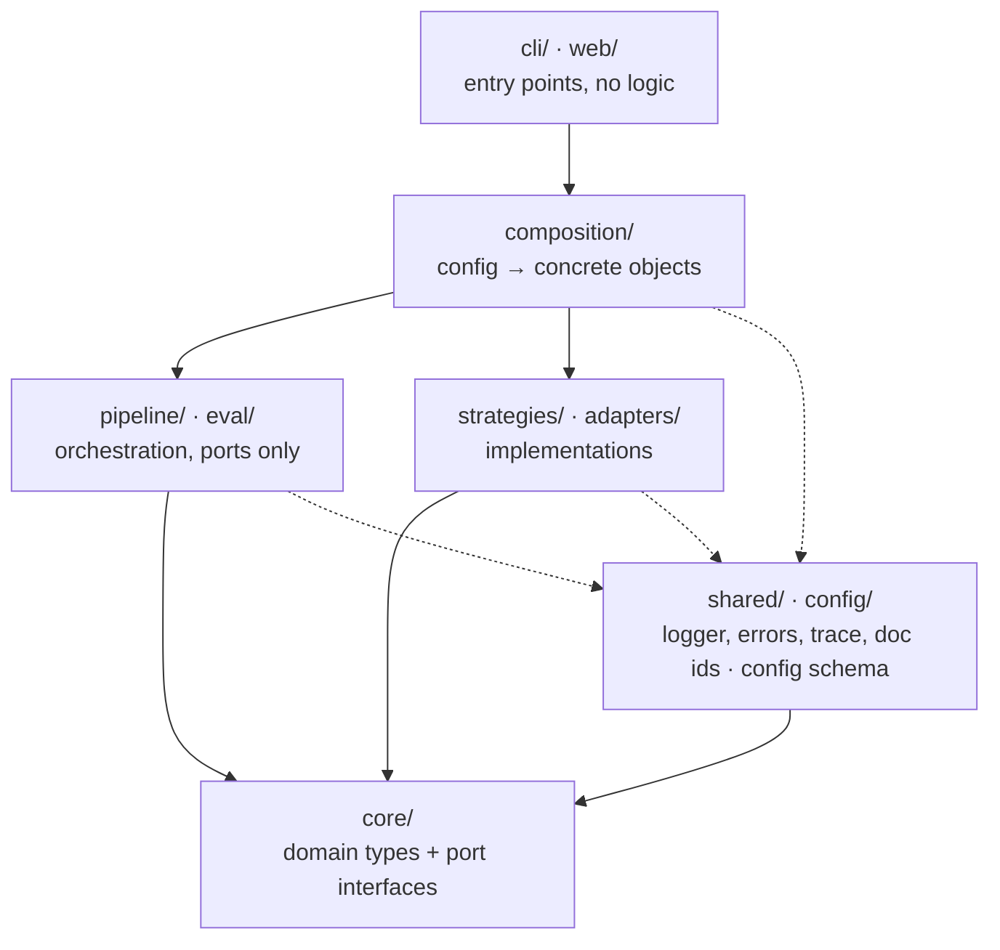

# Architecture

RAG Book uses **ports and adapters**. The RAG logic depends only on interfaces it owns (ports).
Ollama, PDF libraries and vector stores plug in at the edges, so any of them can be swapped or
A/B-tested without touching the pipeline.

## Layers

Dependencies point **downwards only**. Solid arrows are the main flow; dotted arrows show that any
layer may use `shared/` and `config/`.

| Folder         | Role                                                                          | May import                                                    |
| -------------- | ----------------------------------------------------------------------------- | ------------------------------------------------------------- |
| `core/`        | Domain types and port interfaces                                              | `core/` only. No third-party packages (Node built-ins are OK) |
| `strategies/`  | Pure algorithms (chunkers, BM25, RRF)                                         | `core/`, `shared/`, its own folder                            |
| `adapters/`    | The outside world (Ollama, pdf.js, files)                                     | `core/`, `shared/`, its own folder                            |
| `pipeline/`    | Ingest, index, query orchestration                                            | ports in `core/`, `shared/`, `config/`. No concrete classes   |
| `eval/`        | Experiments and metrics                                                       | same as `pipeline/`                                           |
| `composition/` | The only place that turns config into objects (`new OllamaEmbedder(...)`)     | everything                                                    |
| `config/`      | zod schema and loading of `rag.config.json`                                   | `core/`, `shared/`                                            |
| `shared/`      | Logger, errors, trace, document ids (uses the `uuid` package), file hashing   | `core/`, `shared/`                                            |
| `cli/`         | Parse arguments, call the composition root, print. The only place for console | everything except concrete classes (via `composition/`)       |

## Rules enforced automatically

`pnpm deps:check` runs [dependency-cruiser](https://github.com/sverweij/dependency-cruiser) with
[.dependency-cruiser.mjs](../.dependency-cruiser.mjs). Each rule has a `comment` explaining why.

1. `core` imports nothing from the project and no third-party package.
2. `strategies` and `adapters` import only `core`, `shared` and themselves. They never import each other.
3. `pipeline` and `eval` never import a concrete class from `adapters` or `strategies`.
4. Only `composition` imports from `adapters` or `strategies` (test files are exempt).
5. `shared` and `config` stay near the bottom (see the table).
6. Cross-folder imports go through the folder's `index.ts` barrel, not its internals.
7. No circular dependencies.
8. `src/testing/` holds helpers for tests (they import vitest and are left out of the build). Test
   files may import them from any layer; production code may not.

Imports use the `.js` extension (`from "./x.js"`) because the project is ESM (`module: NodeNext`).

## Adding code

- **A new strategy or adapter**: one class in `strategies/<kind>/` or `adapters/<kind>/` implementing a
  port from `core/ports/`, exported from the folder's `index.ts`, plus one registry line in
  `composition/`.
- **Needing something from a layer above you**: that is the signal to introduce a port in `core/`
  instead of importing upwards.
