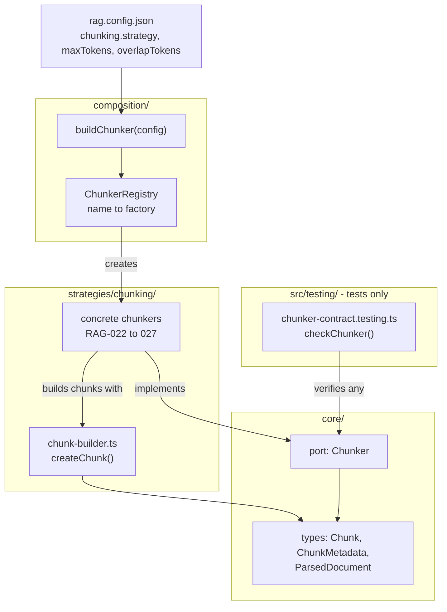
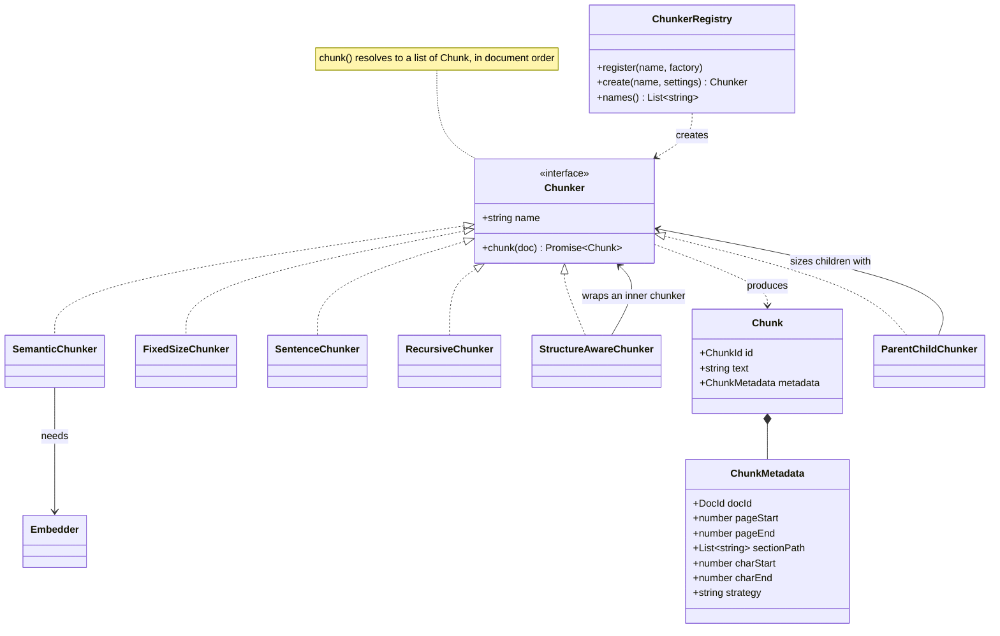
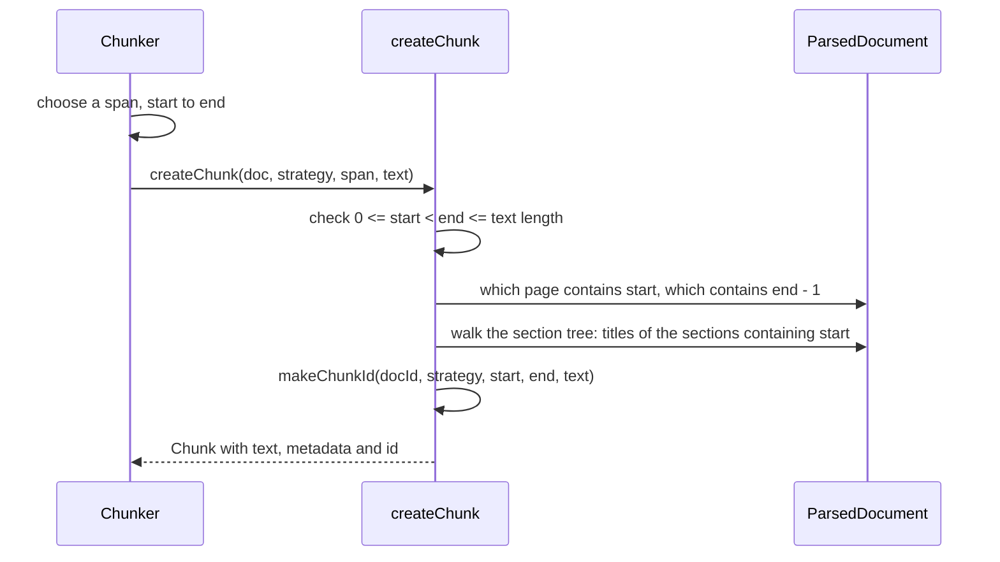
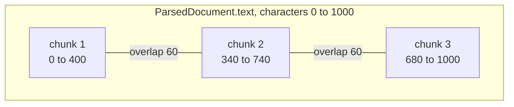
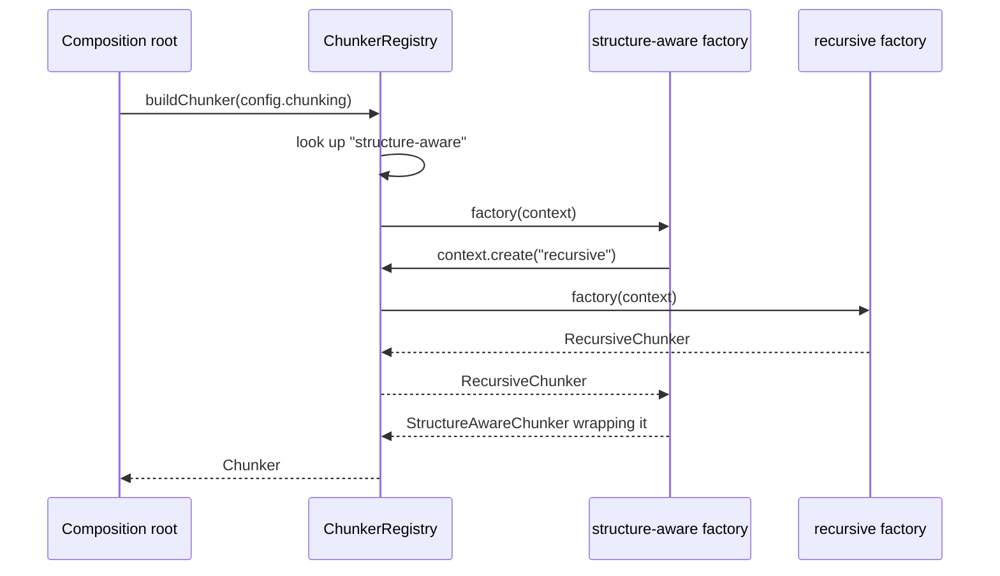
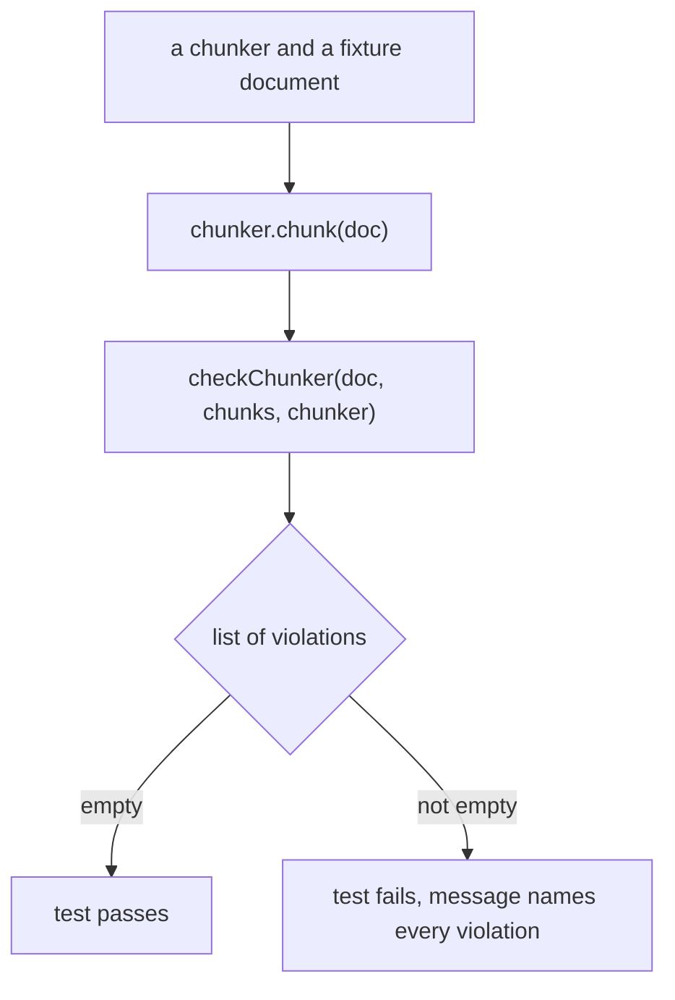
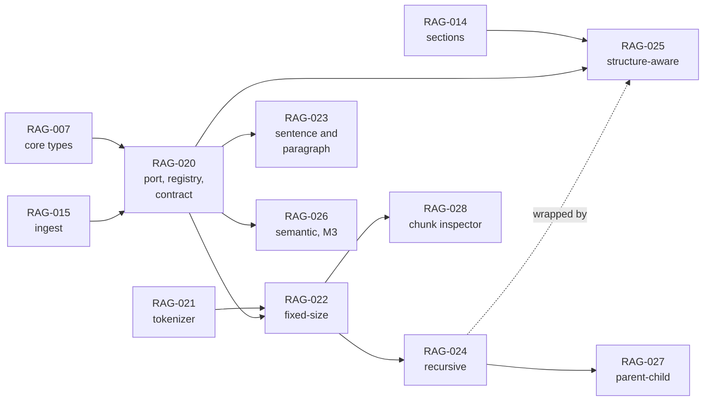
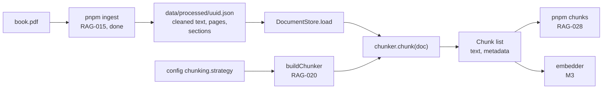

# RAG-020 design: Chunker port, registry and metadata

**Ticket:** M2, architecture, 3 points. Depends on RAG-007 (types) and RAG-015 (ingest).
**Status:** **built** (2026-10-07). Every decision in section 4 was approved by you: D1 (chunk text
may differ from the document) with D1a (whitespace only), D2 deferred (embedded text), and
D3 to D10 as recommended. The decisions are recorded in
[ADR-0003](../adr/0003-chunk-contract.md). The rest of this document is the design as built.

## 1. What this ticket delivers

RAG-020 builds **no chunking algorithm**. It builds the contract that every algorithm in M2 and M3
(RAG-022 to 028) has to follow, and the machinery that makes that contract enforceable:

| Piece                                         | Where                                      |
| --------------------------------------------- | ------------------------------------------ |
| `Chunker` port                                | `src/core/ports/chunker.ts`                |
| `createChunk` helper: metadata and ids        | `src/strategies/chunking/chunk-builder.ts` |
| `ChunkerRegistry` and `buildChunker`          | `src/composition/chunker-registry.ts`      |
| Shared **contract test** every chunker passes | `src/testing/chunker-contract.testing.ts`  |

**Not in this ticket:** any real chunker (022 to 027), the tokenizer (021), storing chunks, the
`pnpm chunks` inspector (028), config changes, and **the text that gets embedded** (D2: deferred, so
the `Chunk` type is not changed by this ticket).

The ticket's four acceptance criteria map like this:

| Acceptance criterion                                                     | Met by                                                   |
| ------------------------------------------------------------------------ | -------------------------------------------------------- |
| `Chunker` interface in `core/ports`                                      | `chunker.ts` (section 3)                                 |
| `ChunkerRegistry` maps a config name to a factory                        | `chunker-registry.ts` (section 6)                        |
| Every chunk carries docId, page range, section path, char span, strategy | `createChunk` fills them in one place (section 5)        |
| Shared contract test: spans cover the document, no gaps beyond overlap   | `checkChunker` and `describeChunkerContract` (section 7) |

## 2. Where it sits

The new pieces follow the layer rules from ADR-0001: the port is in `core`, the helper is a pure
strategy, the registry is in `composition`, and the contract test is a test helper.



## 3. The contract

### 3.1 Types

**The `Chunk` and `ChunkMetadata` types stay exactly as they are** (decision D2: how the embedded
text is produced is deferred until embedding is the focus; the chunk factory's standardised output
will feed it). A chunk already carries what this ticket needs:

```ts
interface Chunk {
  readonly id: ChunkId; // makeChunkId(docId, strategy, span, text): already exists
  readonly text: string; // the chunker's version of the passage (D1: it may differ from the document, see D1a)
  readonly metadata: ChunkMetadata; // docId, pageStart, pageEnd, sectionPath, charStart, charEnd, strategy
}
```

The span (`charStart`, `charEnd`) is what ties a chunk to the document. The board's RAG-025 will
later need a second text for the embedder; adding an optional field then is a small, additive change.

### 3.2 The port

```ts
interface Chunker {
  readonly name: string; // "fixed-size", "recursive", ...: the config value and metadata.strategy
  chunk(doc: ParsedDocument): Promise<readonly Chunk[]>;
}
```

It is `async` because the semantic chunker (RAG-026) calls an embedder. The return type is
`readonly Chunk[]` where the board sketch says `Chunk[]`: the same thing, but callers cannot modify it.



### 3.3 Rules every chunker must follow

If approved, these are written on the port and **checked by the contract test**. Each rule exists
for a reason that a later ticket depends on. Rule 1 depends on decision D1a, rule 3 on D6 and rule 6
on D3 in section 4.

| #   | Rule                                                                                                                     | Why it matters                                                          |
| --- | ------------------------------------------------------------------------------------------------------------------------ | ----------------------------------------------------------------------- |
| 1   | `charStart` and `charEnd` mark the passage the chunk came from. `text` may differ from it, but only as far as D1a allows | Evaluation (M8) and the UI work from spans; `text` is what is shown     |
| 2   | Chunks are in document order: starts never go back, ends strictly increase                                               | Lets the inspector and the web reader walk them in order                |
| 3   | Every non-whitespace character is inside some chunk's span. A gap may contain only whitespace                            | A chunker must never silently drop text, or retrieval can never find it |
| 4   | Chunks may overlap, but never leave a gap                                                                                | The only legal reason for spans to touch twice is overlap               |
| 5   | `docId`, `strategy` and ids are correct; ids are unique                                                                  | Indexes built by different strategies stay apart                        |
| 6   | Page range and section path match the document, and are computed by `createChunk`                                        | One implementation, so no chunker can get them subtly wrong             |
| 7   | Same document in, same chunks out; the document is not modified                                                          | Reproducible experiments (A/B tests in M8)                              |
| 8   | An empty document gives no chunks                                                                                        | Edge case every chunker gets wrong at least once                        |

## 4. Decisions awaiting your approval

**All decisions are answered** (D2 is deferred by choice). Each has options, a recommendation and
the reason. D1 to D3 shape the data every later ticket builds on, so they are the
expensive ones to change later.

Fill in the last column, or just tell me your answer and I will record it here.

| #   | Decision                                                                 | Options                                                                                                                              | My recommendation                                                      | Your answer                                                                                       |
| --- | ------------------------------------------------------------------------ | ------------------------------------------------------------------------------------------------------------------------------------ | ---------------------------------------------------------------------- | ------------------------------------------------------------------------------------------------- |
| D1  | Is `chunk.text` an **exact slice** of the document text?                 | (a) exact slice, never rewritten; (b) chunkers may trim or normalise whitespace                                                      | (a): a chunk always points at real characters                          | **(b)**: chunkers may trim or normalise                                                           |
| D1a | **How far** may a chunker change `text` compared with its source span?   | (a) whitespace only (trim, collapse spaces and line breaks); (b) any rewriting                                                       | (a): the contract test can verify it automatically                     | **(a)**: approved                                                                                 |
| D2  | Where does the **embedded text** live?                                   | (a) a stored `embedText` field, as the board says; (b) computed when embedding, from the chunk and its section path                  | (a): matches the board; the embedder needs no section logic            | **deferred**: focus on chunking first; embedding will use the chunk factory's standardised output |
| D3  | Who works out **page range and section path**?                           | (a) one shared `createChunk` helper; (b) each chunker does it itself                                                                 | (a): one implementation, so no chunker gets it subtly wrong            | **(a)**: approved                                                                                 |
| D4  | Shape of the **`chunk()` return type**                                   | (a) `Promise<readonly Chunk[]>`; (b) `Promise<Chunk[]>` as the board sketches; (c) an async stream of chunks                         | (a): same as the board, but callers cannot modify the list             | **(a)**: approved                                                                                 |
| D5  | Shape of the **registry**                                                | (a) a class whose factories can create other chunkers (needed by structure-aware); (b) a plain name-to-factory map like the cleaners | (a): RAG-025 wraps RAG-024, which a plain map cannot express           | **(a)**: approved                                                                                 |
| D6  | How strict is **coverage**?                                              | (a) every non-whitespace character must be in some chunk; (b) chunkers may drop text they judge useless                              | (a): silently dropped text can never be retrieved                      | **(a)**: approved                                                                                 |
| D7  | How is the **contract test** built?                                      | (a) a function returning violations as data, proved against deliberately broken chunkers; (b) plain assertions only                  | (a): the contract itself is tested, not just used                      | **(a)**: approved                                                                                 |
| D8  | **ADR-0003** for D1 to D3?                                               | (a) write it with this ticket; (b) write it later; (c) no ADR                                                                        | (a): they are expensive to reverse, which is what ADRs are for         | **(a)**: approved                                                                                 |
| D9  | **Strategy-specific config** (child and parent size, semantic threshold) | (a) add each setting when its ticket needs it; (b) design the config shape now                                                       | (a): do not guess shapes before the tickets exist                      | **(a)**: approved                                                                                 |
| D10 | **What the ticket ships for testing**                                    | (a) a small reference chunker that lives only in test code; (b) none, test the contract with fakes only; (c) a real chunker          | (a): shows a correct chunker passing; the real ones are RAG-022 to 024 | **(a)**: approved                                                                                 |

What each of D1 to D3 means in practice:

- **D1 (answered: b).** A chunker may tidy its passage, for example trim edges or collapse
  whitespace. The gain: more freedom for chunkers. The price: `text` no longer maps character for
  character onto the document, so the UI and the evaluation must locate a chunk by its **span**
  (`charStart`, `charEnd`), never by searching for its text. D1a decides how far the tidying may go.
- **D1a (answered: a).** With (a), the contract test can check mechanically that nothing but whitespace
  changed: remove all whitespace from both the chunk text and the source span and compare. With (b),
  it can only check spans and metadata, so a chunker could damage the content and still pass.
- **D2 (deferred).** Nothing is added to `Chunk` now. When embedding becomes the focus, the
  structure-aware chunker (RAG-025) will need to put the heading path
  (`Chapter 3 > 3.2 Embeddings`) in front of the text for the embedder, and the question returns then.
- **D3 (answered: a).** A chunker only decides where chunks start and end; `createChunk` fills in the
  rest. This also matches your idea of a chunk factory with standardised output.

## 5. How a chunk is built

A chunker picks a character span and the text it wants to keep for it. `createChunk` turns them
into a complete chunk, with the metadata worked out from the span.



Spans are character offsets into `ParsedDocument.text`. Chunks may overlap by design:



How the metadata is worked out (all in `createChunk`):

- **Page range:** `pageStart` is the page containing character `start` (the next page if `start`
  is in the blank line between pages). `pageEnd` is the page containing `end - 1` (the previous page
  in that case).
- **Section path:** the titles from the chapter down to the deepest section whose span contains
  `start`. Empty when the document has no sections.
- **Id:** `makeChunkId`, which already hashes document, strategy, span and text.

## 6. Registry and composition

`ChunkerRegistry` follows the cleaner and loader registries, with one difference: some chunkers are
built **from other chunkers** (structure-aware wraps recursive), so a factory receives a context
that can create other chunkers by name.

```ts
interface ChunkerSettings {
  maxTokens: number;
  overlapTokens: number;
} // from config.chunking
interface ChunkerBuildContext {
  settings: ChunkerSettings;
  create(name: string): Chunker;
}
type ChunkerFactory = (context: ChunkerBuildContext) => Chunker;
```

Tokenizer and embedder are not part of this ticket. When RAG-021 and RAG-026 arrive, the
**composition root** passes them into the factories when it registers them, so chunkers get them
through their constructors (ADR-0001: only the composition root creates concrete objects).



Behaviour the registry guarantees (each one gets a test):

- `create("x")` for an unknown name fails with `CONFIG_INVALID` and lists the known names.
- Registering the same name twice fails with `INTERNAL` (a programming mistake).
- A strategy that depends on itself, directly or through others, fails with a clear message instead
  of looping forever.
- It is an **instance**, not a global, so tests never leak registrations into each other.

## 7. The contract test

The checks are a pure function that returns violations as **data**. That makes the contract itself
testable: we can feed it deliberately broken chunkers and confirm it catches each one.



```ts
// src/testing/chunker-contract.testing.ts
checkChunker(doc, chunks, chunkerName): Violation[]   // pure; independent of createChunk
describeChunkerContract("fixed-size", () => new FixedSizeChunker(...))   // used by each chunker's test
```

The page and section checks are re-implemented **independently** inside the contract, so a bug in
`createChunk` cannot hide itself by being checked against itself.

**Fixture documents** the contract runs every chunker on: empty; one short line; several pages with
no sections; sections and subsections; very long text; unicode and odd whitespace; blank pages in
the middle.

**Violation codes** and which deliberately broken chunker proves each is caught:

| Code                       | Broken chunker used to prove it                                         |
| -------------------------- | ----------------------------------------------------------------------- |
| `text-differs-from-source` | returns `text` that is not the passage (the exact limit depends on D1a) |
| `span-out-of-range`        | a span that ends past the document                                      |
| `out-of-order`             | returns the chunks reversed                                             |
| `gap`                      | skips a sentence between two chunks                                     |
| `uncovered-edge`           | drops the last paragraph                                                |
| `wrong-doc-id`             | fixed wrong `docId`                                                     |
| `wrong-strategy`           | strategy name differs from `chunker.name`                               |
| `wrong-pages`              | page range off by one                                                   |
| `wrong-section-path`       | always an empty path                                                    |
| `wrong-id`, `duplicate-id` | a constant id                                                           |
| `not-deterministic`        | random split points                                                     |
| `mutated-document`         | modifies the document it was given                                      |
| `nonempty-for-empty`       | returns one chunk for an empty document                                 |

A size limit (`maxTokens`) cannot be checked until the tokenizer exists (RAG-021), so
`describeChunkerContract` takes an **optional** `countTokens` and `maxTokens`; RAG-022 will pass them.

## 8. Where RAG-020 sits in the roadmap

Everything in M2 depends on it, which is why the contract comes first.



How a chunker will be used end to end once the later tickets exist:



## 9. Work plan

Test-first, in this order. Each step ends green (`typecheck`, `lint`, `test`, `deps:check`).
_As built:_ there are two reference chunkers in `strategies/chunking/chunker-contract.test.ts`, a
paragraph one (which collapses whitespace in the text) and an overlapping character-window one (which
crosses pages and sections), and the contract is proved against 14 deliberately broken chunkers.

| Step | Work                                                                                                        | Tests it adds                                                            |
| ---- | ----------------------------------------------------------------------------------------------------------- | ------------------------------------------------------------------------ |
| 1    | Add the `Chunker` port and export it (the `Chunk` type is unchanged)                                        | none needed: types only                                                  |
| 2    | `createChunk` plus `pageRangeOf` and `sectionPathAt` in `strategies/chunking/chunk-builder.ts`              | page edges, separators between pages, nested sections, invalid spans, id |
| 3    | `checkChunker` and the fixture documents in `src/testing/chunker-contract.testing.ts`                       | one test per violation code, using the broken chunkers                   |
| 4    | `describeChunkerContract`, then run it on a small reference chunker (paragraph split) kept in the test file | the contract passes for a correct chunker                                |
| 5    | `ChunkerRegistry` and `buildChunker` in `composition/`                                                      | unknown name, duplicate, cycle, composite lookup, settings passed        |
| 6    | `docs/adr/0003-chunk-contract.md`; update `docs/architecture.md` (registry, contract)                       | none                                                                     |

Estimate: about 40 to 50 new tests; no new dependency; no change to config or to the stored file
format (chunks are not stored yet).

## 10. Risks and open questions

**Risks**

1. **Stale spans.** Spans point into the _cleaned_ text, but a document's id comes only from the
   file hash. If the cleaners or the heading detector change, the id stays the same while the text and
   every span move. Stored chunks and any hand-labelled evaluation spans would silently drift. Not
   fixed here, but worth deciding before RAG-080 (the evaluation dataset): label with page **and a
   short quote**, so a span can be found again, and consider recording the pipeline settings in the
   processed file.
2. **`text` may not match the document (consequence of D1b).** Anything that has to find a chunk in
   the document, such as the web reader highlighting a citation or the evaluation scoring overlap,
   must use the span, not search for the text. Also, the chunker may now do cleaning work that the
   cleaners (RAG-013) already do, so two places can change the same text; D1a limits that.
3. **Tokens versus characters.** Sizes are in tokens, spans are in characters. The contract cannot
   enforce size until the tokenizer exists, so a chunker could exceed `maxTokens` and still pass the
   contract. RAG-022 must add that check.

**Decisions**

The open choices are D1 to D10 in section 4. Risk 1 is a separate decision for later (it is about
the evaluation dataset, RAG-080), and I will raise it again then.
