# M1 Ingestion: function-level sequence diagrams

Back to the [pipeline view](00-pipeline.md). M1 turns a PDF into a stored `ParsedDocument`:
`load → clean → detect sections → save`, behind a hash-based cache.

Source map

| Area          | Files                                                                                             |
| ------------- | ------------------------------------------------------------------------------------------------- |
| Entry         | `cli/ingest.ts`, `cli/ingest-args.ts`, `composition/build-ingest.ts`, `composition/registries.ts` |
| Orchestration | `pipeline/ingest.ts`                                                                              |
| Loaders       | `adapters/loaders/pdfjs-loader.ts`, `unpdf-loader.ts`, `pdf-pages.ts`                             |
| Cleaning      | `strategies/cleaning/cleaning-chain.ts`, `page-edits.ts`, `lines.ts`, `*-cleaner.ts`              |
| Structure     | `strategies/structure/font-heading-detector.ts`, `text-lines.ts`, `markdown.ts`                   |
| Storage       | `adapters/document-stores/file-document-store.ts`, `stored-document.ts`                           |

Cases covered: [1 CLI args](#1-parseingestargs) · [2 buildIngest](#2-buildingest-and-registries) ·
[3 ingest happy path](#3-ingest-new-document) · [4 skip and force](#4-ingest-skip-and-force) ·
[5 ingest failures](#5-ingest-failure-cases) · [6 PdfJsLoader](#6-pdfjsloaderload) ·
[7 UnpdfLoader](#7-unpdfloaderload) · [8 DocumentAssembler](#8-documentassembler-and-buildpage) ·
[9 CleaningChain](#9-cleaningchain) · [10 editDocument](#10-editdocument-and-applyedits) ·
[11 UnicodeCleaner](#11-unicodecleaner) · [12 PageNumberCleaner](#12-pagenumbercleaner) ·
[13 HeaderFooterCleaner](#13-headerfootercleaner) · [14 DehyphenateCleaner](#14-dehyphenatecleaner) ·
[15 FontHeadingDetector](#15-fontheadingdetectordetect) · [16 Heading tree](#16-building-the-section-tree) ·
[17 FileDocumentStore.save](#17-filedocumentstoresave) · [18 FileDocumentStore.load and has](#18-filedocumentstoreload-and-has) ·
[19 export:markdown](#19-pnpm-exportmarkdown)

---

## 1. `parseIngestArgs`

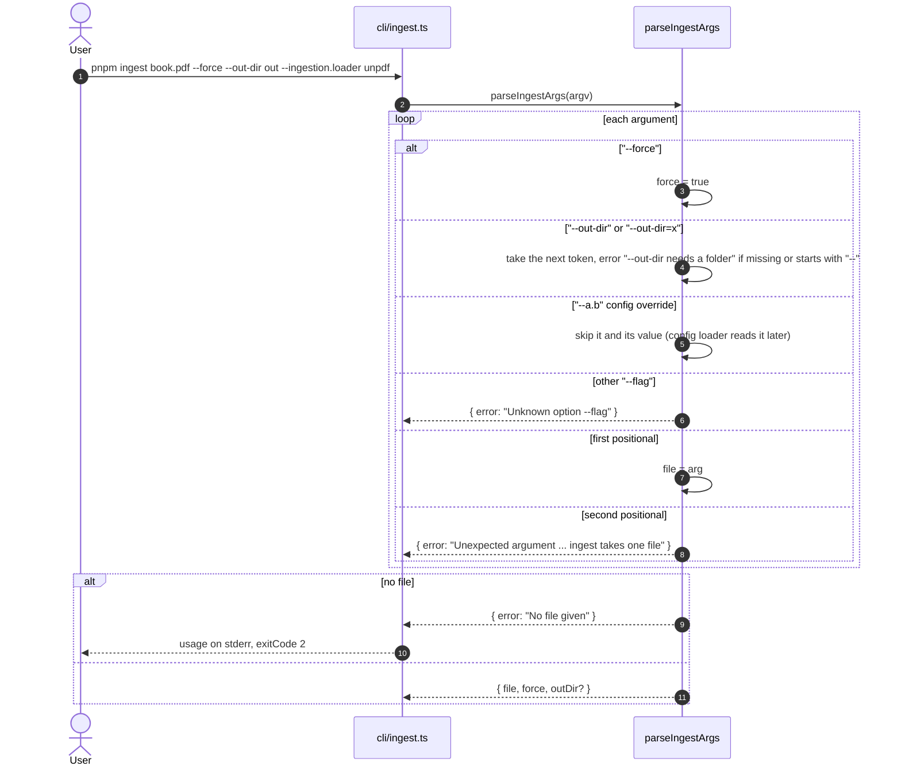
```mermaid
sequenceDiagram
  autonumber
  actor User
  participant CLI as cli/ingest.ts
  participant PA as parseIngestArgs

  User->>CLI: pnpm ingest book.pdf --force --out-dir out --ingestion.loader unpdf
  CLI->>PA: parseIngestArgs(argv)
  loop each argument
    alt "--force"
      PA->>PA: force = true
    else "--out-dir" or "--out-dir=x"
      PA->>PA: take the next token, error "--out-dir needs a folder" if missing or starts with "--"
    else "--a.b" config override
      PA->>PA: skip it and its value (config loader reads it later)
    else other "--flag"
      PA-->>CLI: { error: "Unknown option --flag" }
    else first positional
      PA->>PA: file = arg
    else second positional
      PA-->>CLI: { error: "Unexpected argument ... ingest takes one file" }
    end
  end
  alt no file
    PA-->>CLI: { error: "No file given" }
    CLI-->>User: usage on stderr, exitCode 2
  else
    PA-->>CLI: { file, force, outDir? }
  end
```

## 2. `buildIngest` and registries

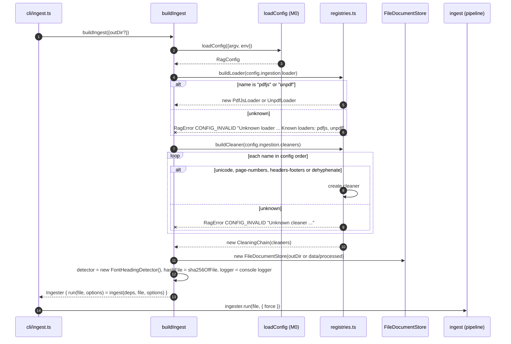
```mermaid
sequenceDiagram
  autonumber
  participant CLI as cli/ingest.ts
  participant BI as buildIngest
  participant LC as loadConfig (M0)
  participant R as registries.ts
  participant FDS as FileDocumentStore
  participant Ing as ingest (pipeline)

  CLI->>BI: buildIngest({outDir?})
  BI->>LC: loadConfig({argv, env})
  LC-->>BI: RagConfig
  BI->>R: buildLoader(config.ingestion.loader)
  alt name is "pdfjs" or "unpdf"
    R-->>BI: new PdfJsLoader or UnpdfLoader
  else unknown
    R--xBI: RagError CONFIG_INVALID "Unknown loader ... Known loaders: pdfjs, unpdf"
  end
  BI->>R: buildCleaner(config.ingestion.cleaners)
  loop each name in config order
    alt unicode, page-numbers, headers-footers or dehyphenate
      R->>R: create cleaner
    else unknown
      R--xBI: RagError CONFIG_INVALID "Unknown cleaner ..."
    end
  end
  R-->>BI: new CleaningChain(cleaners)
  BI->>FDS: new FileDocumentStore(outDir or data/processed)
  BI->>BI: detector = new FontHeadingDetector(), hashFile = sha256OfFile, logger = console logger
  BI-->>CLI: Ingester { run(file, options) = ingest(deps, file, options) }
  CLI->>Ing: ingester.run(file, { force })
```

## 3. `ingest`: new document

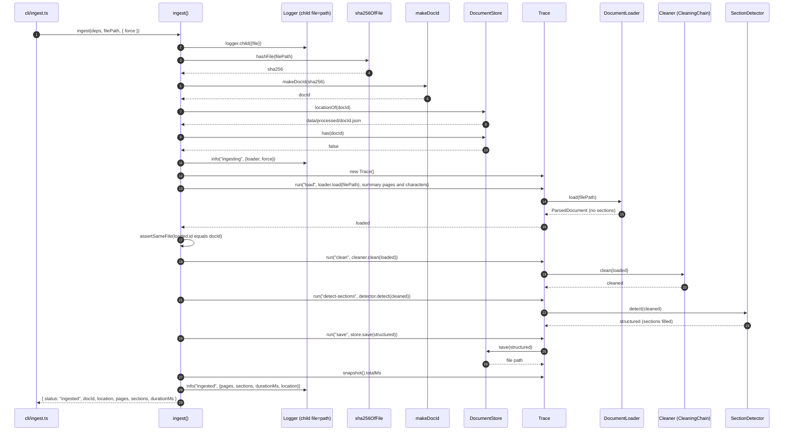
```mermaid
sequenceDiagram
  autonumber
  participant CLI as cli/ingest.ts
  participant Ing as ingest()
  participant Log as Logger (child file=path)
  participant HF as sha256OfFile
  participant MD as makeDocId
  participant St as DocumentStore
  participant Tr as Trace
  participant Ld as DocumentLoader
  participant Cl as Cleaner (CleaningChain)
  participant De as SectionDetector

  CLI->>Ing: ingest(deps, filePath, { force })
  Ing->>Log: logger.child({file})
  Ing->>HF: hashFile(filePath)
  HF-->>Ing: sha256
  Ing->>MD: makeDocId(sha256)
  MD-->>Ing: docId
  Ing->>St: locationOf(docId)
  St-->>Ing: data/processed/docId.json
  Ing->>St: has(docId)
  St-->>Ing: false
  Ing->>Log: info("ingesting", {loader, force})
  Ing->>Tr: new Trace()
  Ing->>Tr: run("load", loader.load(filePath), summary pages and characters)
  Tr->>Ld: load(filePath)
  Ld-->>Tr: ParsedDocument (no sections)
  Tr-->>Ing: loaded
  Ing->>Ing: assertSameFile(loaded.id equals docId)
  Ing->>Tr: run("clean", cleaner.clean(loaded))
  Tr->>Cl: clean(loaded)
  Cl-->>Tr: cleaned
  Ing->>Tr: run("detect-sections", detector.detect(cleaned))
  Tr->>De: detect(cleaned)
  De-->>Tr: structured (sections filled)
  Ing->>Tr: run("save", store.save(structured))
  Tr->>St: save(structured)
  St-->>Tr: file path
  Ing->>Tr: snapshot().totalMs
  Ing->>Log: info("ingested", {pages, sections, durationMs, location})
  Ing-->>CLI: { status: "ingested", docId, location, pages, sections, durationMs }
```

## 4. `ingest`: skip and force

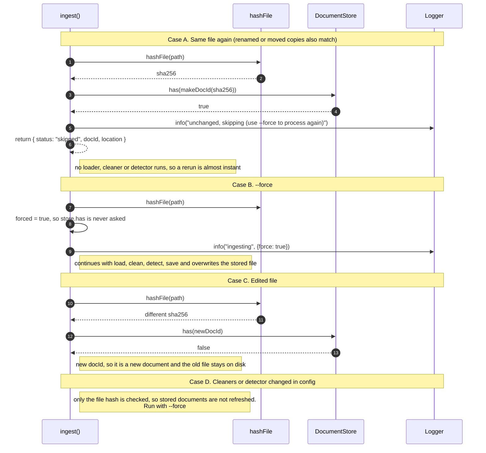
```mermaid
sequenceDiagram
  autonumber
  participant Ing as ingest()
  participant HF as hashFile
  participant St as DocumentStore
  participant Log as Logger

  Note over Ing,Log: Case A. Same file again (renamed or moved copies also match)
  Ing->>HF: hashFile(path)
  HF-->>Ing: sha256
  Ing->>St: has(makeDocId(sha256))
  St-->>Ing: true
  Ing->>Log: info("unchanged, skipping (use --force to process again)")
  Ing-->>Ing: return { status: "skipped", docId, location }
  Note right of Ing: no loader, cleaner or detector runs, so a rerun is almost instant

  Note over Ing,Log: Case B. --force
  Ing->>HF: hashFile(path)
  Ing->>Ing: forced = true, so store.has is never asked
  Ing->>Log: info("ingesting", {force: true})
  Note right of Ing: continues with load, clean, detect, save and overwrites the stored file

  Note over Ing,Log: Case C. Edited file
  Ing->>HF: hashFile(path)
  HF-->>Ing: different sha256
  Ing->>St: has(newDocId)
  St-->>Ing: false
  Note right of Ing: new docId, so it is a new document and the old file stays on disk

  Note over Ing,Log: Case D. Cleaners or detector changed in config
  Note right of Ing: only the file hash is checked, so stored documents are not refreshed.<br/>Run with --force
```

## 5. `ingest` failure cases

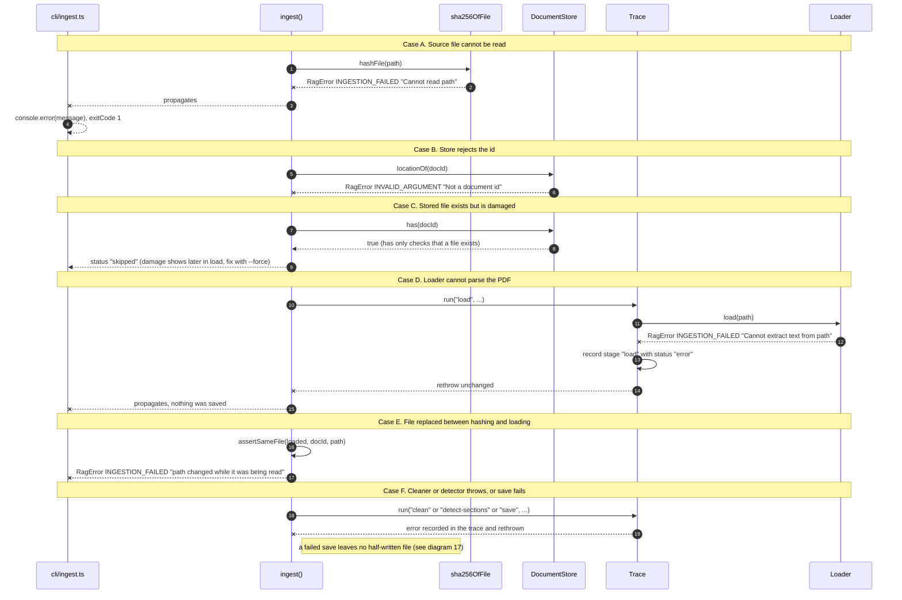
```mermaid
sequenceDiagram
  autonumber
  participant CLI as cli/ingest.ts
  participant Ing as ingest()
  participant HF as sha256OfFile
  participant St as DocumentStore
  participant Tr as Trace
  participant Ld as Loader

  Note over CLI,Ld: Case A. Source file cannot be read
  Ing->>HF: hashFile(path)
  HF--xIng: RagError INGESTION_FAILED "Cannot read path"
  Ing--xCLI: propagates
  CLI-->>CLI: console.error(message), exitCode 1

  Note over CLI,Ld: Case B. Store rejects the id
  Ing->>St: locationOf(docId)
  St--xIng: RagError INVALID_ARGUMENT "Not a document id"

  Note over CLI,Ld: Case C. Stored file exists but is damaged
  Ing->>St: has(docId)
  St-->>Ing: true (has only checks that a file exists)
  Ing-->>CLI: status "skipped" (damage shows later in load, fix with --force)

  Note over CLI,Ld: Case D. Loader cannot parse the PDF
  Ing->>Tr: run("load", ...)
  Tr->>Ld: load(path)
  Ld--xTr: RagError INGESTION_FAILED "Cannot extract text from path"
  Tr->>Tr: record stage "load" with status "error"
  Tr--xIng: rethrow unchanged
  Ing--xCLI: propagates, nothing was saved

  Note over CLI,Ld: Case E. File replaced between hashing and loading
  Ing->>Ing: assertSameFile(loaded, docId, path)
  Ing--xCLI: RagError INGESTION_FAILED "path changed while it was being read"

  Note over CLI,Ld: Case F. Cleaner or detector throws, or save fails
  Ing->>Tr: run("clean" or "detect-sections" or "save", ...)
  Tr--xIng: error recorded in the trace and rethrown
  Note right of Ing: a failed save leaves no half-written file (see diagram 17)
```

## 6. `PdfJsLoader.load`

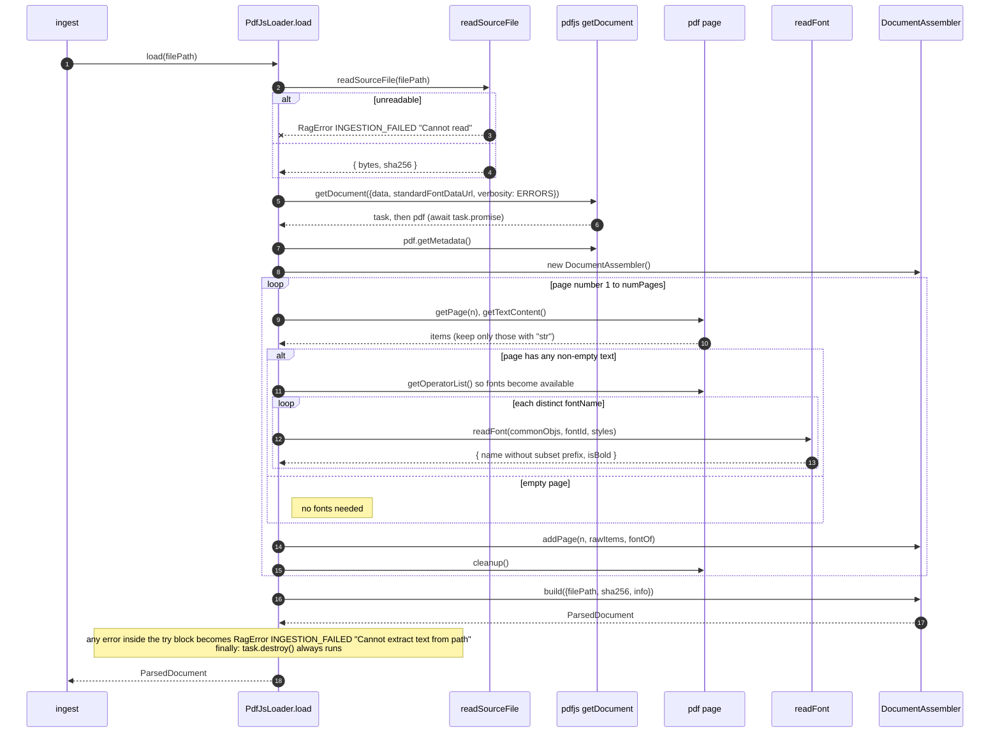
```mermaid
sequenceDiagram
  autonumber
  participant Ing as ingest
  participant PL as PdfJsLoader.load
  participant RS as readSourceFile
  participant PJ as pdfjs getDocument
  participant PG as pdf page
  participant RF as readFont
  participant DA as DocumentAssembler

  Ing->>PL: load(filePath)
  PL->>RS: readSourceFile(filePath)
  alt unreadable
    RS--xPL: RagError INGESTION_FAILED "Cannot read"
  else
    RS-->>PL: { bytes, sha256 }
  end
  PL->>PJ: getDocument({data, standardFontDataUrl, verbosity: ERRORS})
  PJ-->>PL: task, then pdf (await task.promise)
  PL->>PJ: pdf.getMetadata()
  PL->>DA: new DocumentAssembler()
  loop page number 1 to numPages
    PL->>PG: getPage(n), getTextContent()
    PG-->>PL: items (keep only those with "str")
    alt page has any non-empty text
      PL->>PG: getOperatorList() so fonts become available
      loop each distinct fontName
        PL->>RF: readFont(commonObjs, fontId, styles)
        RF-->>PL: { name without subset prefix, isBold }
      end
    else empty page
      Note right of PL: no fonts needed
    end
    PL->>DA: addPage(n, rawItems, fontOf)
    PL->>PG: cleanup()
  end
  PL->>DA: build({filePath, sha256, info})
  DA-->>PL: ParsedDocument
  Note over PL: any error inside the try block becomes RagError INGESTION_FAILED "Cannot extract text from path"<br/>finally: task.destroy() always runs
  PL-->>Ing: ParsedDocument
```

## 7. `UnpdfLoader.load`

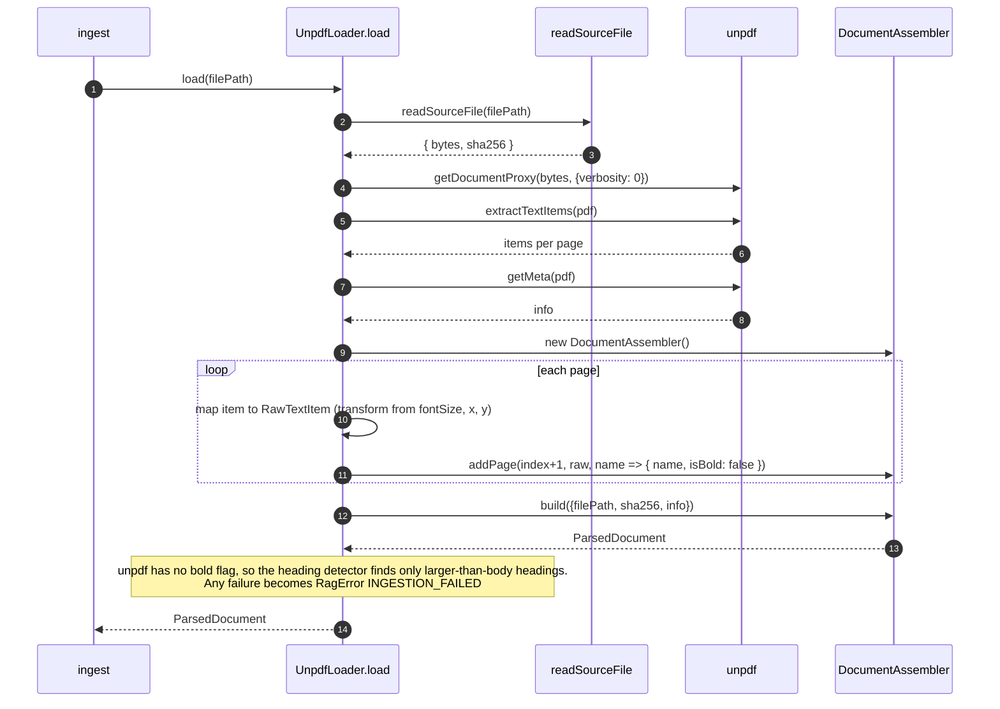
```mermaid
sequenceDiagram
  autonumber
  participant Ing as ingest
  participant UL as UnpdfLoader.load
  participant RS as readSourceFile
  participant UP as unpdf
  participant DA as DocumentAssembler

  Ing->>UL: load(filePath)
  UL->>RS: readSourceFile(filePath)
  RS-->>UL: { bytes, sha256 }
  UL->>UP: getDocumentProxy(bytes, {verbosity: 0})
  UL->>UP: extractTextItems(pdf)
  UP-->>UL: items per page
  UL->>UP: getMeta(pdf)
  UP-->>UL: info
  UL->>DA: new DocumentAssembler()
  loop each page
    UL->>UL: map item to RawTextItem (transform from fontSize, x, y)
    UL->>DA: addPage(index+1, raw, name => { name, isBold: false })
  end
  UL->>DA: build({filePath, sha256, info})
  DA-->>UL: ParsedDocument
  Note over UL: unpdf has no bold flag, so the heading detector finds only larger-than-body headings.<br/>Any failure becomes RagError INGESTION_FAILED
  UL-->>Ing: ParsedDocument
```

## 8. `DocumentAssembler` and `buildPage`

Both loaders share this, so they differ only in how they extract text.

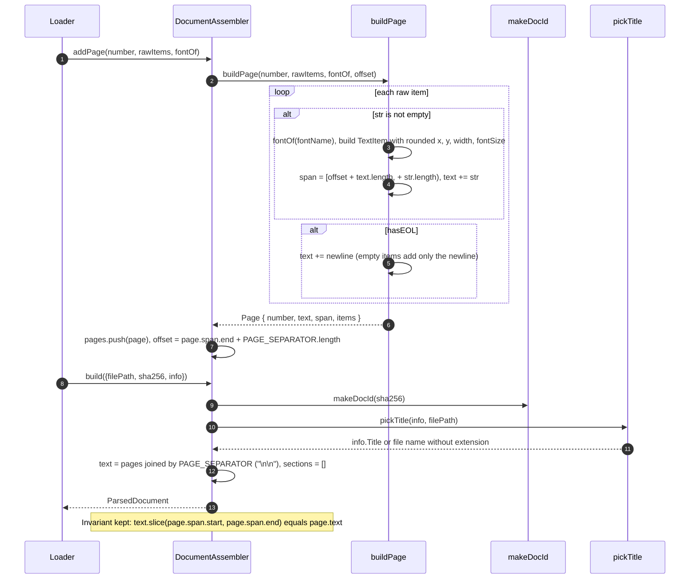
```mermaid
sequenceDiagram
  autonumber
  participant L as Loader
  participant DA as DocumentAssembler
  participant BP as buildPage
  participant MD as makeDocId
  participant PT as pickTitle

  L->>DA: addPage(number, rawItems, fontOf)
  DA->>BP: buildPage(number, rawItems, fontOf, offset)
  loop each raw item
    alt str is not empty
      BP->>BP: fontOf(fontName), build TextItem with rounded x, y, width, fontSize
      BP->>BP: span = [offset + text.length, + str.length), text += str
    end
    alt hasEOL
      BP->>BP: text += newline (empty items add only the newline)
    end
  end
  BP-->>DA: Page { number, text, span, items }
  DA->>DA: pages.push(page), offset = page.span.end + PAGE_SEPARATOR.length
  L->>DA: build({filePath, sha256, info})
  DA->>MD: makeDocId(sha256)
  DA->>PT: pickTitle(info, filePath)
  PT-->>DA: info.Title or file name without extension
  DA->>DA: text = pages joined by PAGE_SEPARATOR ("\n\n"), sections = []
  DA-->>L: ParsedDocument
  Note over DA: Invariant kept: text.slice(page.span.start, page.span.end) equals page.text
```

## 9. `CleaningChain`

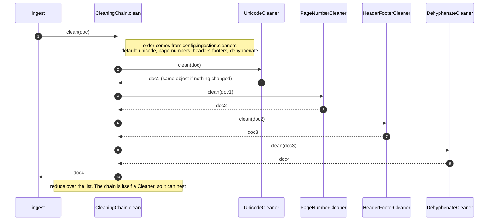
```mermaid
sequenceDiagram
  autonumber
  participant Ing as ingest
  participant CC as CleaningChain.clean
  participant U as UnicodeCleaner
  participant P as PageNumberCleaner
  participant H as HeaderFooterCleaner
  participant D as DehyphenateCleaner

  Ing->>CC: clean(doc)
  Note right of CC: order comes from config.ingestion.cleaners<br/>default: unicode, page-numbers, headers-footers, dehyphenate
  CC->>U: clean(doc)
  U-->>CC: doc1 (same object if nothing changed)
  CC->>P: clean(doc1)
  P-->>CC: doc2
  CC->>H: clean(doc2)
  H-->>CC: doc3
  CC->>D: clean(doc3)
  D-->>CC: doc4
  CC-->>Ing: doc4
  Note over CC: reduce over the list. The chain is itself a Cleaner, so it can nest
```

## 10. `editDocument` and `applyEdits`

The one place that rewrites text and keeps every page span, item span and the document text in step.

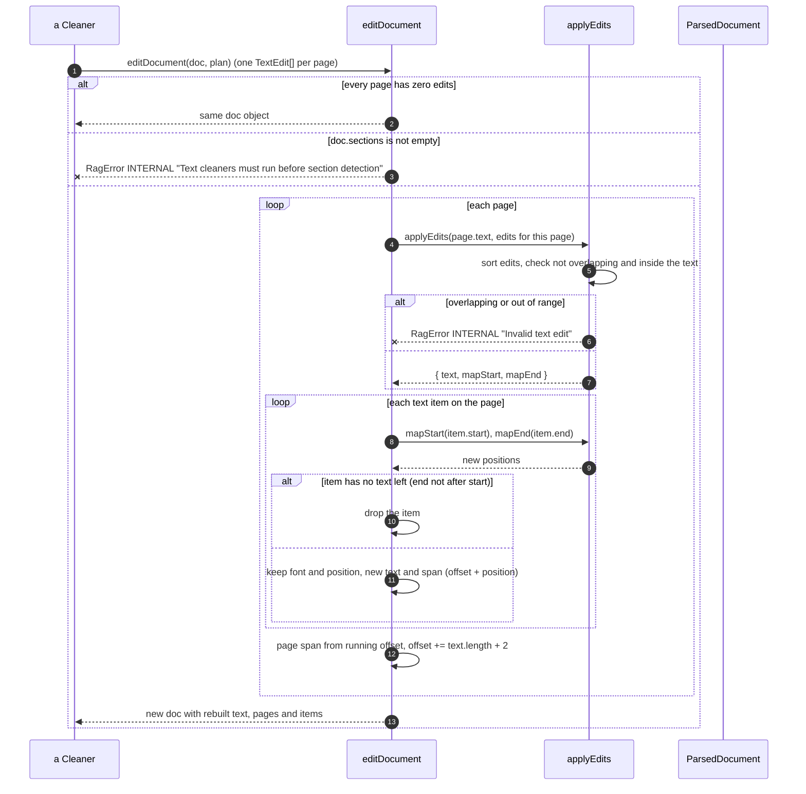
```mermaid
sequenceDiagram
  autonumber
  participant C as a Cleaner
  participant ED as editDocument
  participant AE as applyEdits
  participant Doc as ParsedDocument

  C->>ED: editDocument(doc, plan) (one TextEdit[] per page)
  alt every page has zero edits
    ED-->>C: same doc object
  else doc.sections is not empty
    ED--xC: RagError INTERNAL "Text cleaners must run before section detection"
  else
    loop each page
      ED->>AE: applyEdits(page.text, edits for this page)
      AE->>AE: sort edits, check not overlapping and inside the text
      alt overlapping or out of range
        AE--xED: RagError INTERNAL "Invalid text edit"
      else
        AE-->>ED: { text, mapStart, mapEnd }
      end
      loop each text item on the page
        ED->>AE: mapStart(item.start), mapEnd(item.end)
        AE-->>ED: new positions
        alt item has no text left (end not after start)
          ED->>ED: drop the item
        else
          ED->>ED: keep font and position, new text and span (offset + position)
        end
      end
      ED->>ED: page span from running offset, offset += text.length + 2
    end
    ED-->>C: new doc with rebuilt text, pages and items
  end
```

## 11. `UnicodeCleaner`

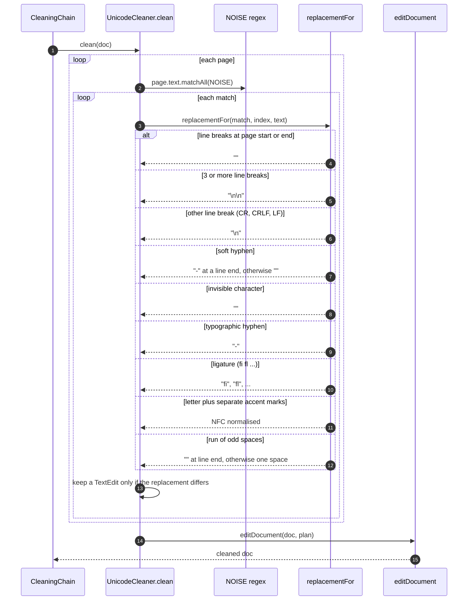
```mermaid
sequenceDiagram
  autonumber
  participant CC as CleaningChain
  participant UC as UnicodeCleaner.clean
  participant RX as NOISE regex
  participant RF as replacementFor
  participant ED as editDocument

  CC->>UC: clean(doc)
  loop each page
    UC->>RX: page.text.matchAll(NOISE)
    loop each match
      UC->>RF: replacementFor(match, index, text)
      alt line breaks at page start or end
        RF-->>UC: ""
      else 3 or more line breaks
        RF-->>UC: "\n\n"
      else other line break (CR, CRLF, LF)
        RF-->>UC: "\n"
      else soft hyphen
        RF-->>UC: "-" at a line end, otherwise ""
      else invisible character
        RF-->>UC: ""
      else typographic hyphen
        RF-->>UC: "-"
      else ligature (fi fl ...)
        RF-->>UC: "fi", "fl", ...
      else letter plus separate accent marks
        RF-->>UC: NFC normalised
      else run of odd spaces
        RF-->>UC: "" at line end, otherwise one space
      end
      UC->>UC: keep a TextEdit only if the replacement differs
    end
  end
  UC->>ED: editDocument(doc, plan)
  ED-->>CC: cleaned doc
```

## 12. `PageNumberCleaner`

A lone number may be real content, so a line is removed only if several pages agree on it.

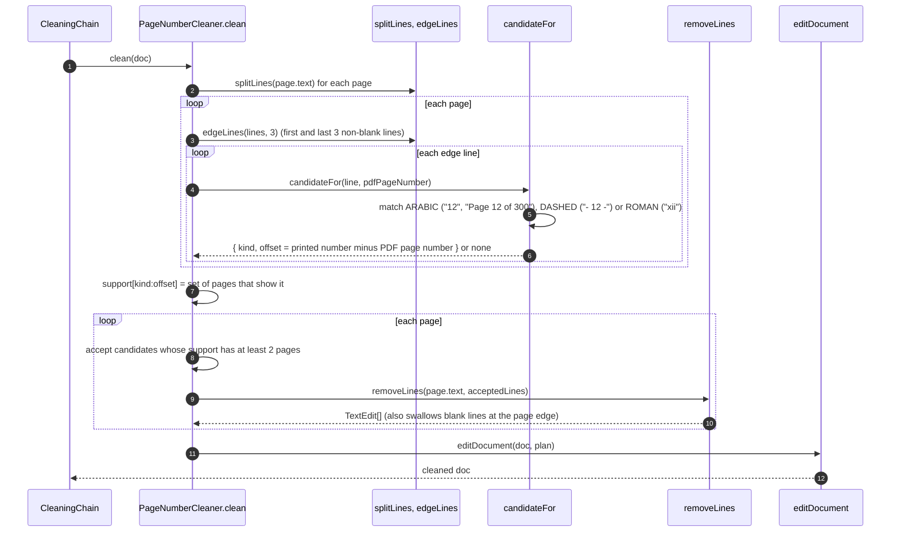
```mermaid
sequenceDiagram
  autonumber
  participant CC as CleaningChain
  participant PN as PageNumberCleaner.clean
  participant SL as splitLines, edgeLines
  participant CF as candidateFor
  participant RL as removeLines
  participant ED as editDocument

  CC->>PN: clean(doc)
  PN->>SL: splitLines(page.text) for each page
  loop each page
    PN->>SL: edgeLines(lines, 3) (first and last 3 non-blank lines)
    loop each edge line
      PN->>CF: candidateFor(line, pdfPageNumber)
      CF->>CF: match ARABIC ("12", "Page 12 of 300"), DASHED ("- 12 -") or ROMAN ("xii")
      CF-->>PN: { kind, offset = printed number minus PDF page number } or none
    end
  end
  PN->>PN: support[kind:offset] = set of pages that show it
  loop each page
    PN->>PN: accept candidates whose support has at least 2 pages
    PN->>RL: removeLines(page.text, acceptedLines)
    RL-->>PN: TextEdit[] (also swallows blank lines at the page edge)
  end
  PN->>ED: editDocument(doc, plan)
  ED-->>CC: cleaned doc
```

## 13. `HeaderFooterCleaner`

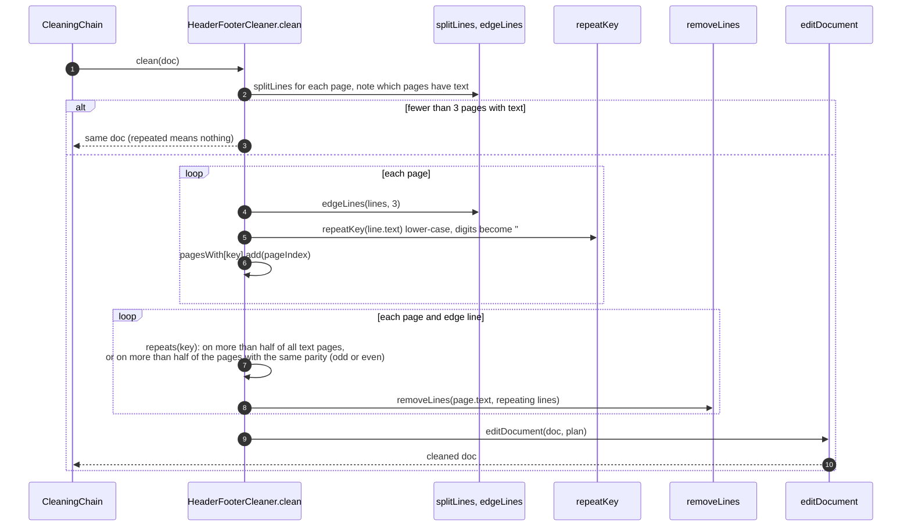
```mermaid
sequenceDiagram
  autonumber
  participant CC as CleaningChain
  participant HF as HeaderFooterCleaner.clean
  participant SL as splitLines, edgeLines
  participant RK as repeatKey
  participant RL as removeLines
  participant ED as editDocument

  CC->>HF: clean(doc)
  HF->>SL: splitLines for each page, note which pages have text
  alt fewer than 3 pages with text
    HF-->>CC: same doc (repeated means nothing)
  else
    loop each page
      HF->>SL: edgeLines(lines, 3)
      HF->>RK: repeatKey(line.text) lower-case, digits become "#", spaces collapsed
      HF->>HF: pagesWith[key].add(pageIndex)
    end
    loop each page and edge line
      HF->>HF: repeats(key): on more than half of all text pages,<br/>or on more than half of the pages with the same parity (odd or even)
      HF->>RL: removeLines(page.text, repeating lines)
    end
    HF->>ED: editDocument(doc, plan)
    ED-->>CC: cleaned doc
  end
```

## 14. `DehyphenateCleaner`

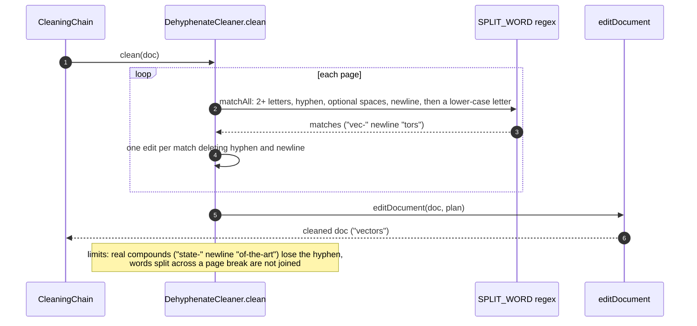
```mermaid
sequenceDiagram
  autonumber
  participant CC as CleaningChain
  participant DH as DehyphenateCleaner.clean
  participant RX as SPLIT_WORD regex
  participant ED as editDocument

  CC->>DH: clean(doc)
  loop each page
    DH->>RX: matchAll: 2+ letters, hyphen, optional spaces, newline, then a lower-case letter
    RX-->>DH: matches ("vec-" newline "tors")
    DH->>DH: one edit per match deleting hyphen and newline
  end
  DH->>ED: editDocument(doc, plan)
  ED-->>CC: cleaned doc ("vectors")
  Note over DH: limits: real compounds ("state-" newline "of-the-art") lose the hyphen,<br/>words split across a page break are not joined
```

## 15. `FontHeadingDetector.detect`

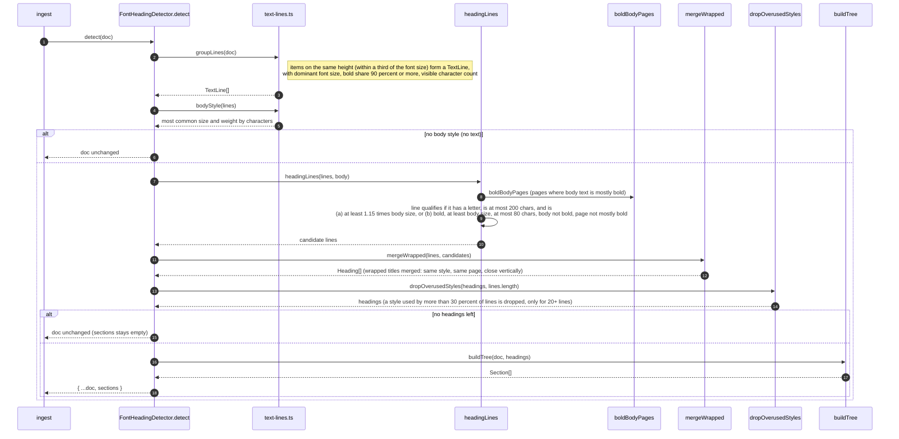
```mermaid
sequenceDiagram
  autonumber
  participant Ing as ingest
  participant FD as FontHeadingDetector.detect
  participant TL as text-lines.ts
  participant HL as headingLines
  participant BB as boldBodyPages
  participant MW as mergeWrapped
  participant OS as dropOverusedStyles
  participant BT as buildTree

  Ing->>FD: detect(doc)
  FD->>TL: groupLines(doc)
  Note right of TL: items on the same height (within a third of the font size) form a TextLine,<br/>with dominant font size, bold share 90 percent or more, visible character count
  TL-->>FD: TextLine[]
  FD->>TL: bodyStyle(lines)
  TL-->>FD: most common size and weight by characters
  alt no body style (no text)
    FD-->>Ing: doc unchanged
  else
    FD->>HL: headingLines(lines, body)
    HL->>BB: boldBodyPages (pages where body text is mostly bold)
    HL->>HL: line qualifies if it has a letter, is at most 200 chars, and is<br/>(a) at least 1.15 times body size, or (b) bold, at least body size, at most 80 chars, body not bold, page not mostly bold
    HL-->>FD: candidate lines
    FD->>MW: mergeWrapped(lines, candidates)
    MW-->>FD: Heading[] (wrapped titles merged: same style, same page, close vertically)
    FD->>OS: dropOverusedStyles(headings, lines.length)
    OS-->>FD: headings (a style used by more than 30 percent of lines is dropped, only for 20+ lines)
    alt no headings left
      FD-->>Ing: doc unchanged (sections stays empty)
    else
      FD->>BT: buildTree(doc, headings)
      BT-->>FD: Section[]
      FD-->>Ing: { ...doc, sections }
    end
  end
```

## 16. Building the section tree

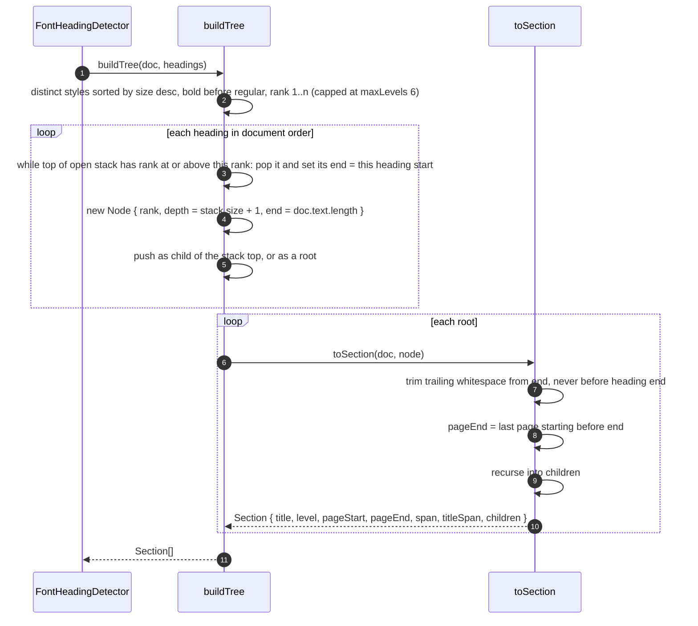
```mermaid
sequenceDiagram
  autonumber
  participant FD as FontHeadingDetector
  participant BT as buildTree
  participant TS as toSection

  FD->>BT: buildTree(doc, headings)
  BT->>BT: distinct styles sorted by size desc, bold before regular, rank 1..n (capped at maxLevels 6)
  loop each heading in document order
    BT->>BT: while top of open stack has rank at or above this rank: pop it and set its end = this heading start
    BT->>BT: new Node { rank, depth = stack size + 1, end = doc.text.length }
    BT->>BT: push as child of the stack top, or as a root
  end
  loop each root
    BT->>TS: toSection(doc, node)
    TS->>TS: trim trailing whitespace from end, never before heading end
    TS->>TS: pageEnd = last page starting before end
    TS->>TS: recurse into children
    TS-->>BT: Section { title, level, pageStart, pageEnd, span, titleSpan, children }
  end
  BT-->>FD: Section[]
```

## 17. `FileDocumentStore.save`

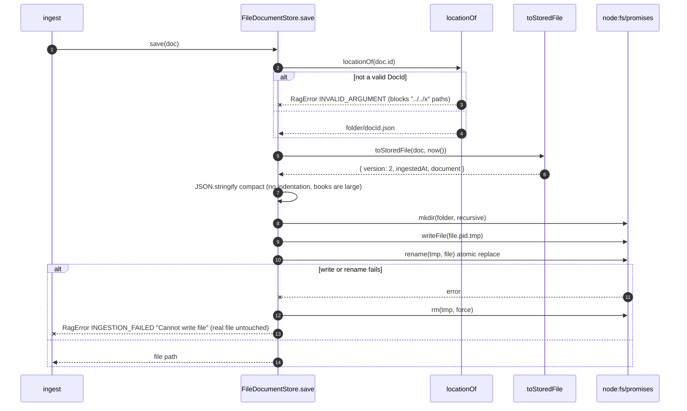
```mermaid
sequenceDiagram
  autonumber
  participant Ing as ingest
  participant FS as FileDocumentStore.save
  participant LO as locationOf
  participant SD as toStoredFile
  participant FSp as node:fs/promises

  Ing->>FS: save(doc)
  FS->>LO: locationOf(doc.id)
  alt not a valid DocId
    LO--xFS: RagError INVALID_ARGUMENT (blocks "../../x" paths)
  else
    LO-->>FS: folder/docId.json
  end
  FS->>SD: toStoredFile(doc, now())
  SD-->>FS: { version: 2, ingestedAt, document }
  FS->>FS: JSON.stringify compact (no indentation, books are large)
  FS->>FSp: mkdir(folder, recursive)
  FS->>FSp: writeFile(file.pid.tmp)
  FS->>FSp: rename(tmp, file) atomic replace
  alt write or rename fails
    FSp--xFS: error
    FS->>FSp: rm(tmp, force)
    FS--xIng: RagError INGESTION_FAILED "Cannot write file" (real file untouched)
  else
    FS-->>Ing: file path
  end
```

## 18. `FileDocumentStore.load` and `has`

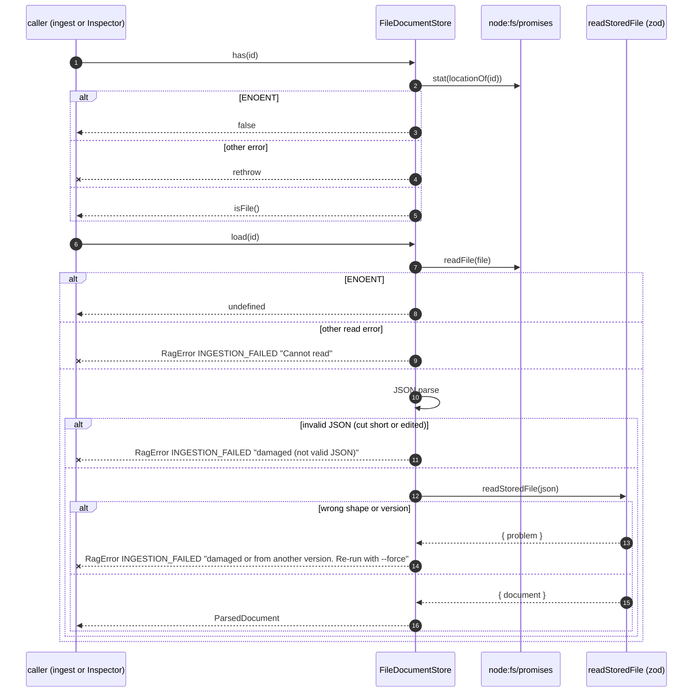
```mermaid
sequenceDiagram
  autonumber
  participant Cl as caller (ingest or Inspector)
  participant FS as FileDocumentStore
  participant FSp as node:fs/promises
  participant RS as readStoredFile (zod)

  Cl->>FS: has(id)
  FS->>FSp: stat(locationOf(id))
  alt ENOENT
    FS-->>Cl: false
  else other error
    FS--xCl: rethrow
  else
    FS-->>Cl: isFile()
  end

  Cl->>FS: load(id)
  FS->>FSp: readFile(file)
  alt ENOENT
    FS-->>Cl: undefined
  else other read error
    FS--xCl: RagError INGESTION_FAILED "Cannot read"
  else
    FS->>FS: JSON.parse
    alt invalid JSON (cut short or edited)
      FS--xCl: RagError INGESTION_FAILED "damaged (not valid JSON)"
    else
      FS->>RS: readStoredFile(json)
      alt wrong shape or version
        RS-->>FS: { problem }
        FS--xCl: RagError INGESTION_FAILED "damaged or from another version. Re-run with --force"
      else
        RS-->>FS: { document }
        FS-->>Cl: ParsedDocument
      end
    end
  end
```

## 19. `pnpm export:markdown`

A debugging script that runs the M1 steps without storing anything, to read the result.

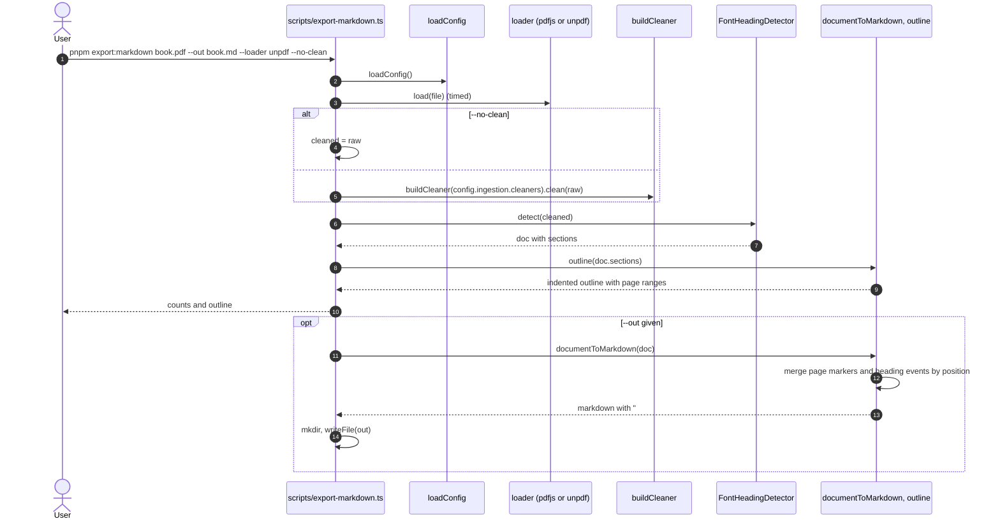
```mermaid
sequenceDiagram
  autonumber
  actor User
  participant EM as scripts/export-markdown.ts
  participant LC as loadConfig
  participant Ld as loader (pdfjs or unpdf)
  participant BC as buildCleaner
  participant FD as FontHeadingDetector
  participant MD as documentToMarkdown, outline

  User->>EM: pnpm export:markdown book.pdf --out book.md --loader unpdf --no-clean
  EM->>LC: loadConfig()
  EM->>Ld: load(file) (timed)
  alt --no-clean
    EM->>EM: cleaned = raw
  else
    EM->>BC: buildCleaner(config.ingestion.cleaners).clean(raw)
  end
  EM->>FD: detect(cleaned)
  FD-->>EM: doc with sections
  EM->>MD: outline(doc.sections)
  MD-->>EM: indented outline with page ranges
  EM-->>User: counts and outline
  opt --out given
    EM->>MD: documentToMarkdown(doc)
    MD->>MD: merge page markers and heading events by position
    MD-->>EM: markdown with "# title" lines and "page N" comments
    EM->>EM: mkdir, writeFile(out)
  end
```
