# M2 Chunking: function-level sequence diagrams

Back to the [pipeline view](00-pipeline.md). M2 cuts a stored `ParsedDocument` into `Chunk[]`
behind one `Chunker` port, and lets you inspect what each strategy produced.

Source map

| Area          | Files                                                                                                                                                                                                                                     |
| ------------- | ----------------------------------------------------------------------------------------------------------------------------------------------------------------------------------------------------------------------------------------- |
| Port, types   | `core/ports/chunker.ts`, `tokenizer.ts`, `core/types/chunk.ts`                                                                                                                                                                            |
| Shared helper | `strategies/chunking/chunk-builder.ts` (`createChunk`, `pageRangeOf`, `sectionPathAt`)                                                                                                                                                    |
| Strategies    | `fixed-size-chunker.ts`, `recursive-chunker.ts` + `recursive-split.ts`, `structure-aware-chunker.ts` + `section-segments.ts`, `parent-child-chunker.ts`, `semantic-chunker.ts` + `semantic-breakpoints.ts` + `basic-sentence-splitter.ts` |
| Tokenizers    | `adapters/tokenizers/approx-tokenizer.ts`, `tiktoken-tokenizer.ts`                                                                                                                                                                        |
| Wiring        | `composition/chunker-registry.ts`, `build-chunkers.ts`, `build-inspect.ts`, `registries.ts`                                                                                                                                               |
| Inspector     | `cli/chunks.ts`, `chunks-args.ts`, `composition/inspect-summary.ts`, `strategies/chunking/chunk-stats.ts`, `chunk-report.ts`                                                                                                              |

Cases covered: [1 CLI args](#1-parsechunksargs) · [2 buildInspect](#2-buildinspect) ·
[3 Inspector.run](#3-inspectorrun-happy-path-and-failures) · [4 Registry](#4-chunkerregistry) ·
[5 createChunk](#5-createchunk) · [6 Tokenizers](#6-tokenizers) · [7 FixedSizeChunker](#7-fixedsizechunker) ·
[8 RecursiveChunker](#8-recursivechunker) · [9 splitRecursive](#9-splitrecursive) · [10 packGroups](#10-packgroups-and-packpieces) ·
[11 Section segments](#11-sectionsegments-and-documentview) · [12 StructureAwareChunker](#12-structureawarechunker) ·
[13 ParentChildChunker](#13-parentchildchunker) · [14 SemanticChunker](#14-semanticchunker) ·
[15 Breakpoints](#15-semantic-breakpoints) · [16 Stats and report](#16-chunk-stats-and-report) ·
[17 Contract test](#17-the-shared-contract-test)

---

## 1. `parseChunksArgs`

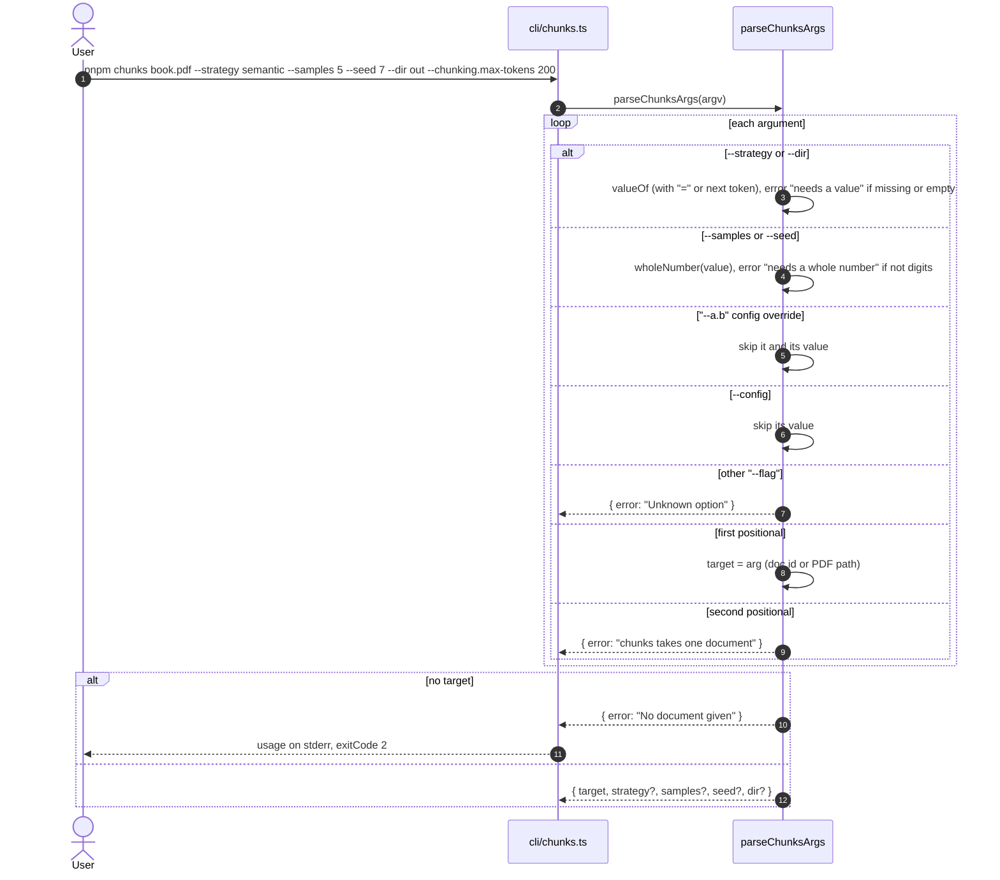
```mermaid
sequenceDiagram
  autonumber
  actor User
  participant CLI as cli/chunks.ts
  participant PA as parseChunksArgs

  User->>CLI: pnpm chunks book.pdf --strategy semantic --samples 5 --seed 7 --dir out --chunking.max-tokens 200
  CLI->>PA: parseChunksArgs(argv)
  loop each argument
    alt --strategy or --dir
      PA->>PA: valueOf (with "=" or next token), error "needs a value" if missing or empty
    else --samples or --seed
      PA->>PA: wholeNumber(value), error "needs a whole number" if not digits
    else "--a.b" config override
      PA->>PA: skip it and its value
    else --config
      PA->>PA: skip its value
    else other "--flag"
      PA-->>CLI: { error: "Unknown option" }
    else first positional
      PA->>PA: target = arg (doc id or PDF path)
    else second positional
      PA-->>CLI: { error: "chunks takes one document" }
    end
  end
  alt no target
    PA-->>CLI: { error: "No document given" }
    CLI-->>User: usage on stderr, exitCode 2
  else
    PA-->>CLI: { target, strategy?, samples?, seed?, dir? }
  end
```

## 2. `buildInspect`

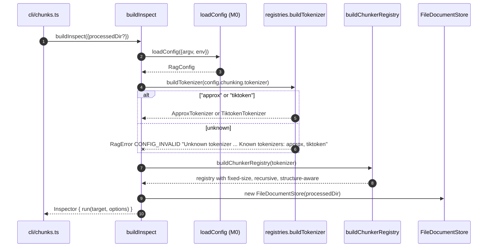
```mermaid
sequenceDiagram
  autonumber
  participant CLI as cli/chunks.ts
  participant BI as buildInspect
  participant LC as loadConfig (M0)
  participant RT as registries.buildTokenizer
  participant BR as buildChunkerRegistry
  participant FDS as FileDocumentStore

  CLI->>BI: buildInspect({processedDir?})
  BI->>LC: loadConfig({argv, env})
  LC-->>BI: RagConfig
  BI->>RT: buildTokenizer(config.chunking.tokenizer)
  alt "approx" or "tiktoken"
    RT-->>BI: ApproxTokenizer or TiktokenTokenizer
  else unknown
    RT--xBI: RagError CONFIG_INVALID "Unknown tokenizer ... Known tokenizers: approx, tiktoken"
  end
  BI->>BR: buildChunkerRegistry(tokenizer)
  BR-->>BI: registry with fixed-size, recursive, structure-aware
  BI->>FDS: new FileDocumentStore(processedDir)
  BI-->>CLI: Inspector { run(target, options) }
```

## 3. `Inspector.run`: happy path and failures

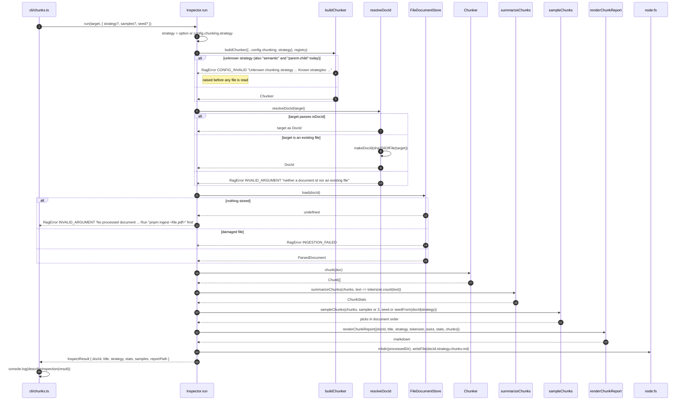
```mermaid
sequenceDiagram
  autonumber
  participant CLI as cli/chunks.ts
  participant IN as Inspector.run
  participant BC as buildChunker
  participant RD as resolveDocId
  participant ST as FileDocumentStore
  participant CK as Chunker
  participant SU as summarizeChunks
  participant SA as sampleChunks
  participant RR as renderChunkReport
  participant FS as node:fs

  CLI->>IN: run(target, { strategy?, samples?, seed? })
  IN->>IN: strategy = option or config.chunking.strategy
  IN->>BC: buildChunker({...config.chunking, strategy}, registry)
  alt unknown strategy (also "semantic" and "parent-child" today)
    BC--xIN: RagError CONFIG_INVALID "Unknown chunking strategy ... Known strategies: ..."
    Note right of IN: raised before any file is read
  else
    BC-->>IN: Chunker
  end
  IN->>RD: resolveDocId(target)
  alt target passes isDocId
    RD-->>IN: target as DocId
  else target is an existing file
    RD->>RD: makeDocId(sha256OfFile(target))
    RD-->>IN: DocId
  else
    RD--xIN: RagError INVALID_ARGUMENT "neither a document id nor an existing file"
  end
  IN->>ST: load(docId)
  alt nothing stored
    ST-->>IN: undefined
    IN--xCLI: RagError INVALID_ARGUMENT 'No processed document ... Run "pnpm ingest <file.pdf>" first'
  else damaged file
    ST--xIN: RagError INGESTION_FAILED
  else
    ST-->>IN: ParsedDocument
  end
  IN->>CK: chunk(doc)
  CK-->>IN: Chunk[]
  IN->>SU: summarizeChunks(chunks, text => tokenizer.count(text))
  SU-->>IN: ChunkStats
  IN->>SA: sampleChunks(chunks, samples or 3, seed or seedFrom(docId|strategy))
  SA-->>IN: picks in document order
  IN->>RR: renderChunkReport({docId, title, strategy, tokenizer, sizes, stats, chunks})
  RR-->>IN: markdown
  IN->>FS: mkdir(processedDir), writeFile(docId.strategy.chunks.md)
  IN-->>CLI: InspectResult { docId, title, strategy, stats, samples, reportPath }
  CLI->>CLI: console.log(describeInspection(result))
```

## 4. `ChunkerRegistry`

Chunkers made of chunkers (structure-aware wraps recursive) ask the build context for the inner one.

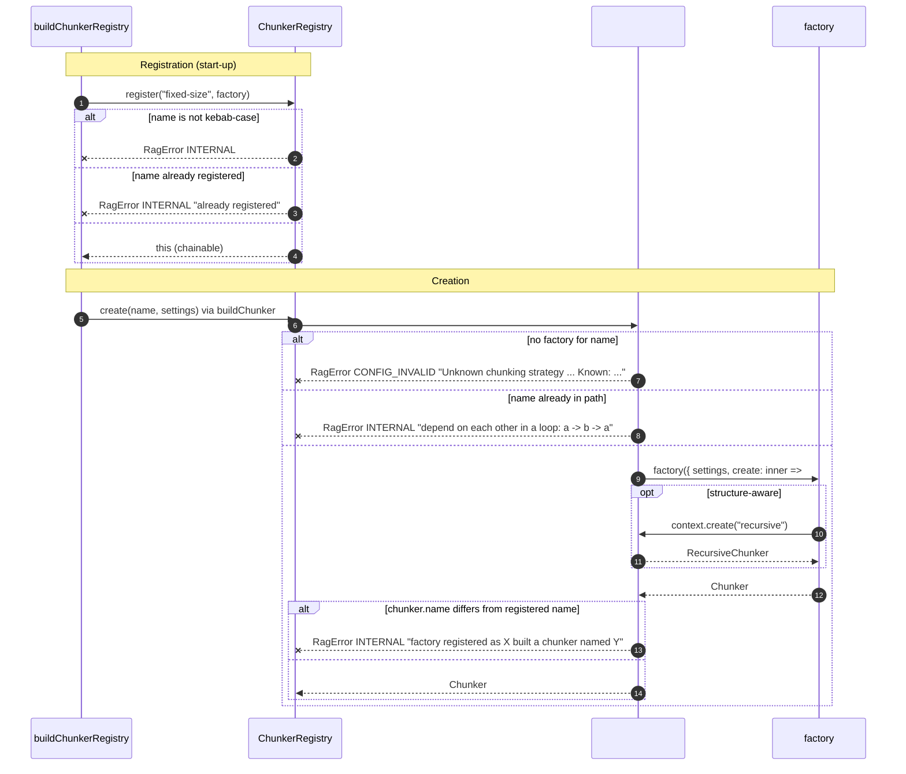
```mermaid
sequenceDiagram
  autonumber
  participant BC as buildChunkerRegistry
  participant R as ChunkerRegistry
  participant B as #build
  participant F as factory

  Note over BC,R: Registration (start-up)
  BC->>R: register("fixed-size", factory)
  alt name is not kebab-case
    R--xBC: RagError INTERNAL
  else name already registered
    R--xBC: RagError INTERNAL "already registered"
  else
    R-->>BC: this (chainable)
  end

  Note over BC,F: Creation
  BC->>R: create(name, settings) via buildChunker
  R->>B: #build(name, settings, path=[])
  alt no factory for name
    B--xR: RagError CONFIG_INVALID "Unknown chunking strategy ... Known: ..."
  else name already in path
    B--xR: RagError INTERNAL "depend on each other in a loop: a -> b -> a"
  else
    B->>F: factory({ settings, create: inner => #build(inner, settings, [...path, name]) })
    opt structure-aware
      F->>B: context.create("recursive")
      B-->>F: RecursiveChunker
    end
    F-->>B: Chunker
    alt chunker.name differs from registered name
      B--xR: RagError INTERNAL "factory registered as X built a chunker named Y"
    else
      B-->>R: Chunker
    end
  end
```

## 5. `createChunk`

The single place that turns a span into a complete `Chunk`. Every strategy goes through it.

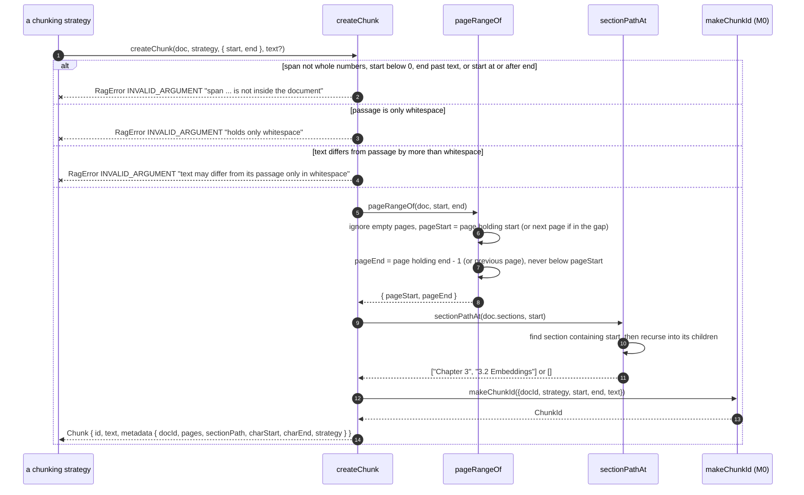
```mermaid
sequenceDiagram
  autonumber
  participant S as a chunking strategy
  participant CC as createChunk
  participant PR as pageRangeOf
  participant SP as sectionPathAt
  participant MC as makeChunkId (M0)

  S->>CC: createChunk(doc, strategy, { start, end }, text?)
  alt span not whole numbers, start below 0, end past text, or start at or after end
    CC--xS: RagError INVALID_ARGUMENT "span ... is not inside the document"
  else passage is only whitespace
    CC--xS: RagError INVALID_ARGUMENT "holds only whitespace"
  else text differs from passage by more than whitespace
    CC--xS: RagError INVALID_ARGUMENT "text may differ from its passage only in whitespace"
  else
    CC->>PR: pageRangeOf(doc, start, end)
    PR->>PR: ignore empty pages, pageStart = page holding start (or next page if in the gap)
    PR->>PR: pageEnd = page holding end - 1 (or previous page), never below pageStart
    PR-->>CC: { pageStart, pageEnd }
    CC->>SP: sectionPathAt(doc.sections, start)
    SP->>SP: find section containing start, then recurse into its children
    SP-->>CC: ["Chapter 3", "3.2 Embeddings"] or []
    CC->>MC: makeChunkId({docId, strategy, start, end, text})
    MC-->>CC: ChunkId
    CC-->>S: Chunk { id, text, metadata { docId, pages, sectionPath, charStart, charEnd, strategy } }
  end
```

## 6. Tokenizers

`count` measures size. `tokenSpans` ties tokens back to characters, which fixed-size chunking needs.

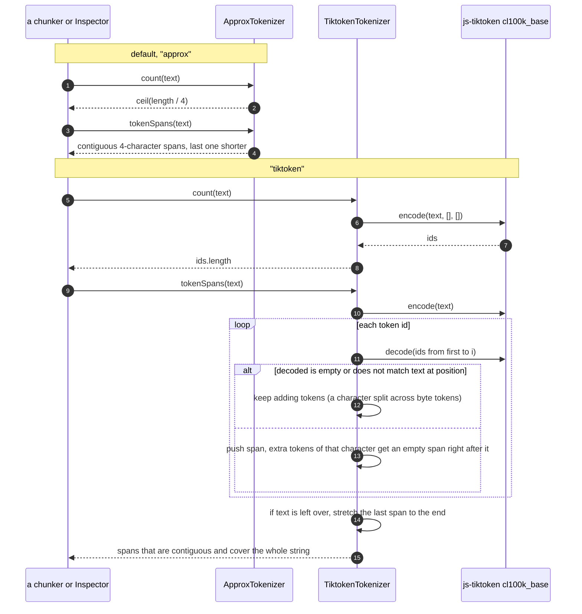
```mermaid
sequenceDiagram
  autonumber
  participant C as a chunker or Inspector
  participant AT as ApproxTokenizer
  participant TT as TiktokenTokenizer
  participant ENC as js-tiktoken cl100k_base

  Note over C,AT: default, "approx"
  C->>AT: count(text)
  AT-->>C: ceil(length / 4)
  C->>AT: tokenSpans(text)
  AT-->>C: contiguous 4-character spans, last one shorter

  Note over C,ENC: "tiktoken"
  C->>TT: count(text)
  TT->>ENC: encode(text, [], [])
  ENC-->>TT: ids
  TT-->>C: ids.length
  C->>TT: tokenSpans(text)
  TT->>ENC: encode(text)
  loop each token id
    TT->>ENC: decode(ids from first to i)
    alt decoded is empty or does not match text at position
      TT->>TT: keep adding tokens (a character split across byte tokens)
    else
      TT->>TT: push span, extra tokens of that character get an empty span right after it
    end
  end
  TT->>TT: if text is left over, stretch the last span to the end
  TT-->>C: spans that are contiguous and cover the whole string
```

## 7. `FixedSizeChunker`

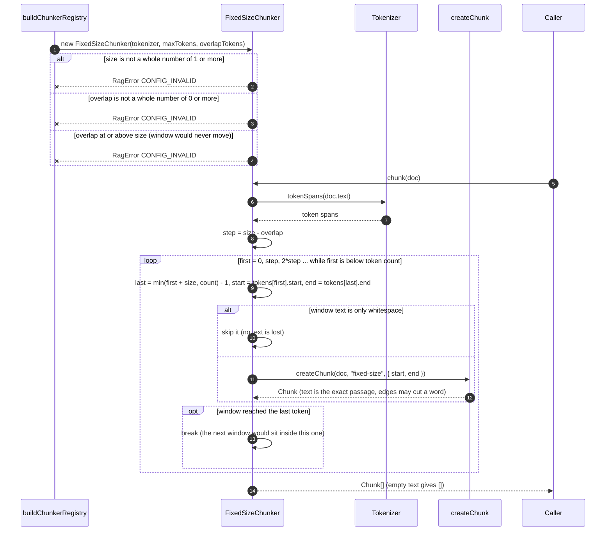
```mermaid
sequenceDiagram
  autonumber
  participant BC as buildChunkerRegistry
  participant FX as FixedSizeChunker
  participant TK as Tokenizer
  participant CC as createChunk
  participant Caller

  BC->>FX: new FixedSizeChunker(tokenizer, maxTokens, overlapTokens)
  alt size is not a whole number of 1 or more
    FX--xBC: RagError CONFIG_INVALID
  else overlap is not a whole number of 0 or more
    FX--xBC: RagError CONFIG_INVALID
  else overlap at or above size (window would never move)
    FX--xBC: RagError CONFIG_INVALID
  end

  Caller->>FX: chunk(doc)
  FX->>TK: tokenSpans(doc.text)
  TK-->>FX: token spans
  FX->>FX: step = size - overlap
  loop first = 0, step, 2*step ... while first is below token count
    FX->>FX: last = min(first + size, count) - 1, start = tokens[first].start, end = tokens[last].end
    alt window text is only whitespace
      FX->>FX: skip it (no text is lost)
    else
      FX->>CC: createChunk(doc, "fixed-size", { start, end })
      CC-->>FX: Chunk (text is the exact passage, edges may cut a word)
    end
    opt window reached the last token
      FX->>FX: break (the next window would sit inside this one)
    end
  end
  FX-->>Caller: Chunk[] (empty text gives [])
```

## 8. `RecursiveChunker`

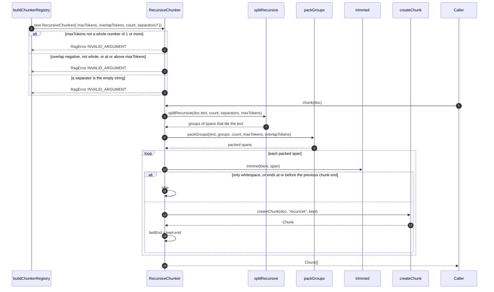
```mermaid
sequenceDiagram
  autonumber
  participant BC as buildChunkerRegistry
  participant RC as RecursiveChunker
  participant SR as splitRecursive
  participant PG as packGroups
  participant TR as trimmed
  participant CC as createChunk
  participant Caller

  BC->>RC: new RecursiveChunker({ maxTokens, overlapTokens, count, separators? })
  alt maxTokens not a whole number of 1 or more
    RC--xBC: RagError INVALID_ARGUMENT
  else overlap negative, not whole, or at or above maxTokens
    RC--xBC: RagError INVALID_ARGUMENT
  else a separator is the empty string
    RC--xBC: RagError INVALID_ARGUMENT
  end

  Caller->>RC: chunk(doc)
  RC->>SR: splitRecursive(doc.text, count, separators, maxTokens)
  SR-->>RC: groups of spans that tile the text
  RC->>PG: packGroups(text, groups, count, maxTokens, overlapTokens)
  PG-->>RC: packed spans
  loop each packed span
    RC->>TR: trimmed(text, span)
    alt only whitespace, or ends at or before the previous chunk end
      RC->>RC: skip
    else
      RC->>CC: createChunk(doc, "recursive", kept)
      CC-->>RC: Chunk
      RC->>RC: lastEnd = kept.end
    end
  end
  RC-->>Caller: Chunk[]
```

## 9. `splitRecursive`

The pure step that cuts on the biggest separator that works, then smaller ones, and finally by length.

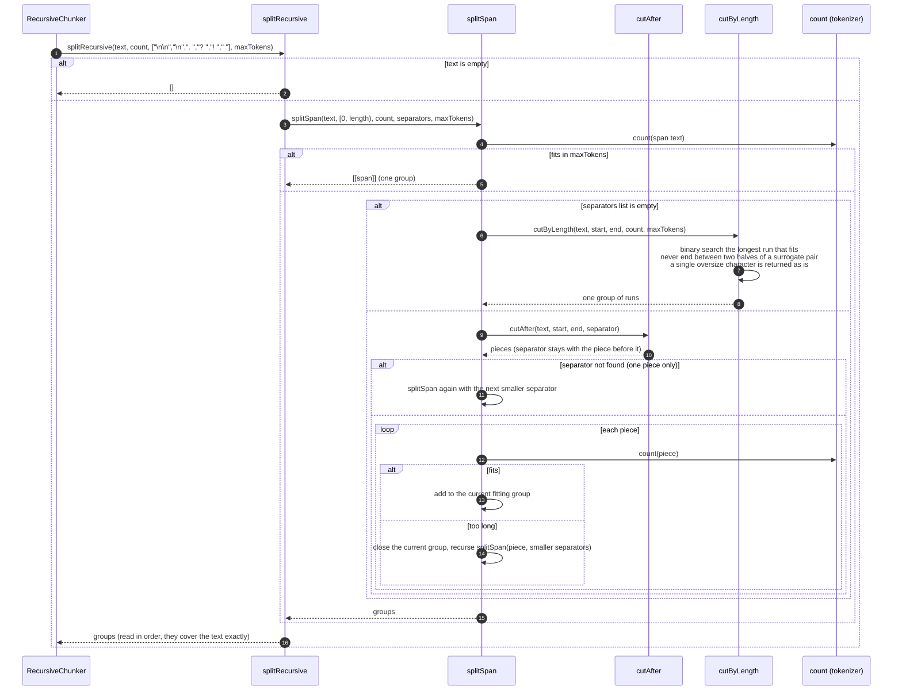
```mermaid
sequenceDiagram
  autonumber
  participant RC as RecursiveChunker
  participant SR as splitRecursive
  participant SS as splitSpan
  participant CA as cutAfter
  participant CL as cutByLength
  participant CT as count (tokenizer)

  RC->>SR: splitRecursive(text, count, ["\n\n","\n",". ","? ","! "," "], maxTokens)
  alt text is empty
    SR-->>RC: []
  else
    SR->>SS: splitSpan(text, [0, length), count, separators, maxTokens)
    SS->>CT: count(span text)
    alt fits in maxTokens
      SS-->>SR: [[span]] (one group)
    else
      alt separators list is empty
        SS->>CL: cutByLength(text, start, end, count, maxTokens)
        CL->>CL: binary search the longest run that fits<br/>never end between two halves of a surrogate pair<br/>a single oversize character is returned as is
        CL-->>SS: one group of runs
      else
        SS->>CA: cutAfter(text, start, end, separator)
        CA-->>SS: pieces (separator stays with the piece before it)
        alt separator not found (one piece only)
          SS->>SS: splitSpan again with the next smaller separator
        else
          loop each piece
            SS->>CT: count(piece)
            alt fits
              SS->>SS: add to the current fitting group
            else too long
              SS->>SS: close the current group, recurse splitSpan(piece, smaller separators)
            end
          end
        end
      end
      SS-->>SR: groups
    end
    SR-->>RC: groups (read in order, they cover the text exactly)
  end
```

## 10. `packGroups` and `packPieces`

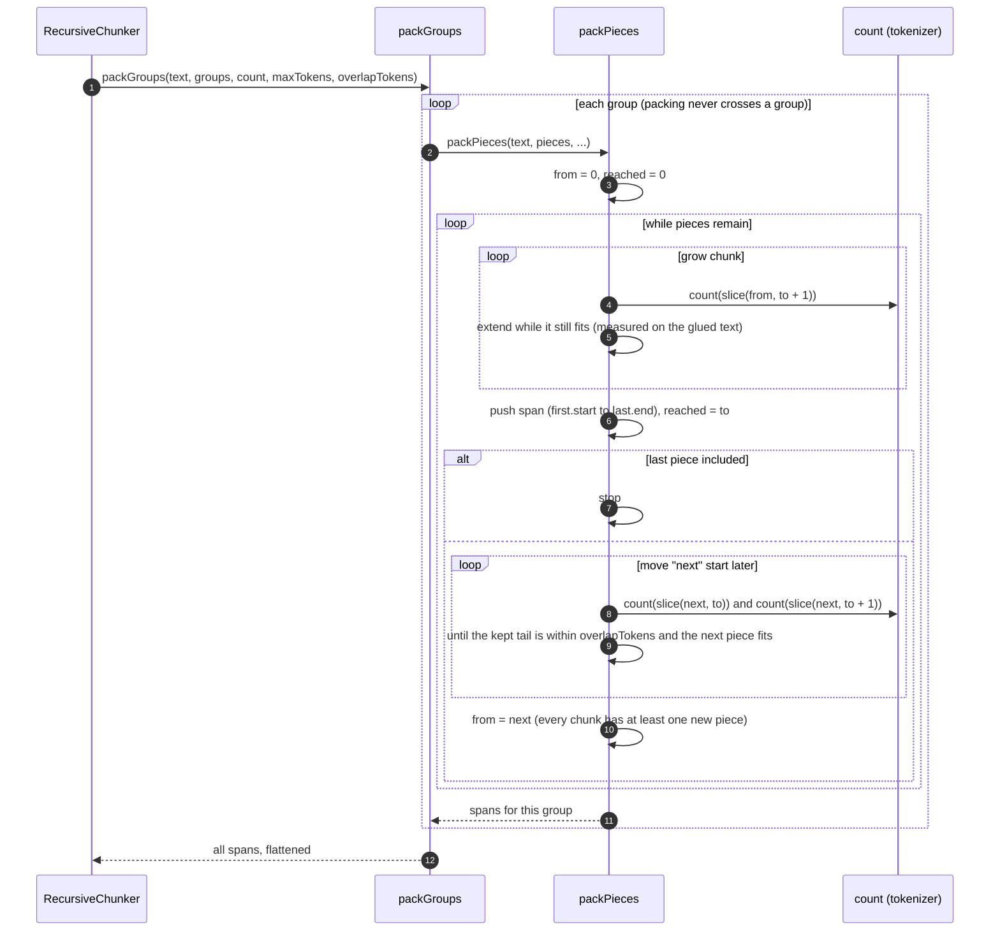
```mermaid
sequenceDiagram
  autonumber
  participant RC as RecursiveChunker
  participant PGs as packGroups
  participant PP as packPieces
  participant CT as count (tokenizer)

  RC->>PGs: packGroups(text, groups, count, maxTokens, overlapTokens)
  loop each group (packing never crosses a group)
    PGs->>PP: packPieces(text, pieces, ...)
    PP->>PP: from = 0, reached = 0
    loop while pieces remain
      loop grow chunk
        PP->>CT: count(slice(from, to + 1))
        PP->>PP: extend while it still fits (measured on the glued text)
      end
      PP->>PP: push span (first.start to last.end), reached = to
      alt last piece included
        PP->>PP: stop
      else
        loop move "next" start later
          PP->>CT: count(slice(next, to)) and count(slice(next, to + 1))
          PP->>PP: until the kept tail is within overlapTokens and the next piece fits
        end
        PP->>PP: from = next (every chunk has at least one new piece)
      end
    end
    PP-->>PGs: spans for this group
  end
  PGs-->>RC: all spans, flattened
```

## 11. `sectionSegments` and `documentView`

Helpers for strategies that work section by section.

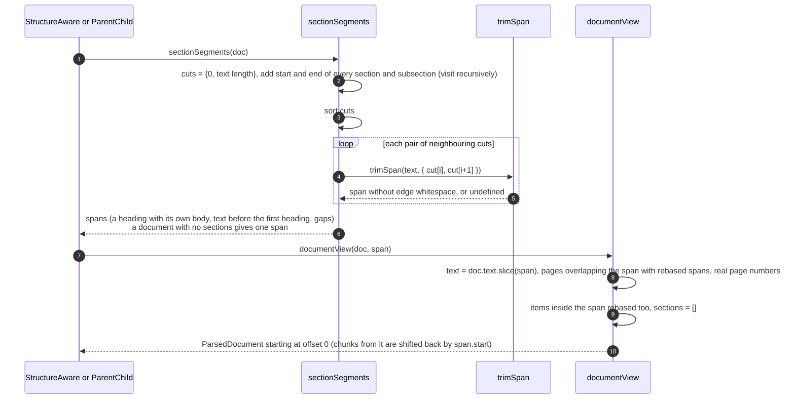
```mermaid
sequenceDiagram
  autonumber
  participant S as StructureAware or ParentChild
  participant SG as sectionSegments
  participant TS as trimSpan
  participant DV as documentView

  S->>SG: sectionSegments(doc)
  SG->>SG: cuts = {0, text length}, add start and end of every section and subsection (visit recursively)
  SG->>SG: sort cuts
  loop each pair of neighbouring cuts
    SG->>TS: trimSpan(text, { cut[i], cut[i+1] })
    TS-->>SG: span without edge whitespace, or undefined
  end
  SG-->>S: spans (a heading with its own body, text before the first heading, gaps)<br/>a document with no sections gives one span

  S->>DV: documentView(doc, span)
  DV->>DV: text = doc.text.slice(span), pages overlapping the span with rebased spans, real page numbers
  DV->>DV: items inside the span rebased too, sections = []
  DV-->>S: ParsedDocument starting at offset 0 (chunks from it are shifted back by span.start)
```

## 12. `StructureAwareChunker`

One chunk per section, long sections handed to an inner chunker, heading path put in `embedText`.

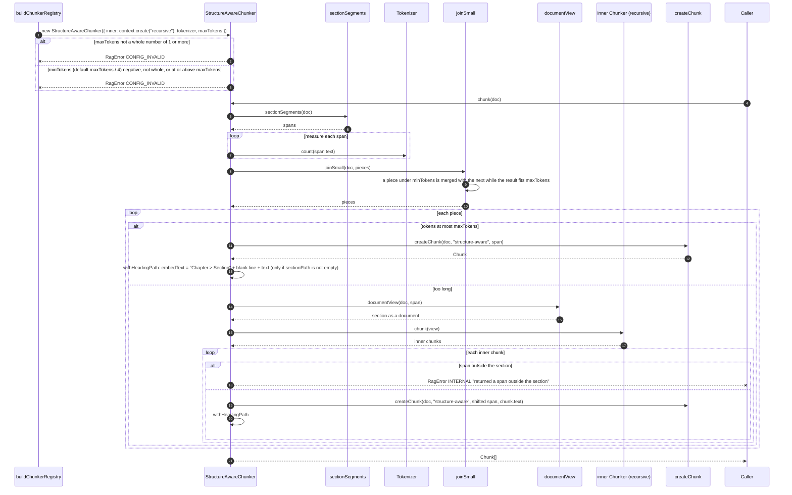
```mermaid
sequenceDiagram
  autonumber
  participant BC as buildChunkerRegistry
  participant SA as StructureAwareChunker
  participant SG as sectionSegments
  participant TK as Tokenizer
  participant JS as joinSmall
  participant DV as documentView
  participant IN as inner Chunker (recursive)
  participant CC as createChunk
  participant Caller

  BC->>SA: new StructureAwareChunker({ inner: context.create("recursive"), tokenizer, maxTokens })
  alt maxTokens not a whole number of 1 or more
    SA--xBC: RagError CONFIG_INVALID
  else minTokens (default maxTokens / 4) negative, not whole, or at or above maxTokens
    SA--xBC: RagError CONFIG_INVALID
  end

  Caller->>SA: chunk(doc)
  SA->>SG: sectionSegments(doc)
  SG-->>SA: spans
  loop measure each span
    SA->>TK: count(span text)
  end
  SA->>JS: joinSmall(doc, pieces)
  JS->>JS: a piece under minTokens is merged with the next while the result fits maxTokens
  JS-->>SA: pieces
  loop each piece
    alt tokens at most maxTokens
      SA->>CC: createChunk(doc, "structure-aware", span)
      CC-->>SA: Chunk
      SA->>SA: withHeadingPath: embedText = "Chapter > Section" + blank line + text (only if sectionPath is not empty)
    else too long
      SA->>DV: documentView(doc, span)
      DV-->>SA: section as a document
      SA->>IN: chunk(view)
      IN-->>SA: inner chunks
      loop each inner chunk
        alt span outside the section
          SA--xCaller: RagError INTERNAL "returned a span outside the section"
        else
          SA->>CC: createChunk(doc, "structure-aware", shifted span, chunk.text)
          SA->>SA: withHeadingPath
        end
      end
    end
  end
  SA-->>Caller: Chunk[]
```

## 13. `ParentChildChunker`

Search small, answer big. `chunk()` returns children (each with `parentId`), `parents()` returns the parents.

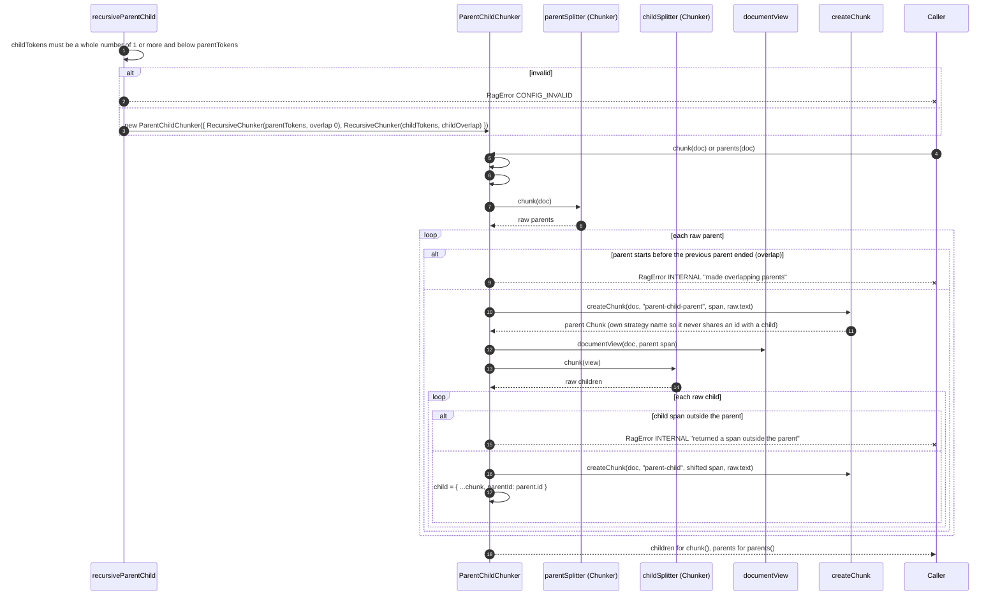
```mermaid
sequenceDiagram
  autonumber
  participant F as recursiveParentChild
  participant PC as ParentChildChunker
  participant PS as parentSplitter (Chunker)
  participant CS as childSplitter (Chunker)
  participant DV as documentView
  participant CC as createChunk
  participant Caller

  F->>F: childTokens must be a whole number of 1 or more and below parentTokens
  alt invalid
    F--xCaller: RagError CONFIG_INVALID
  else
    F->>PC: new ParentChildChunker({ RecursiveChunker(parentTokens, overlap 0), RecursiveChunker(childTokens, childOverlap) })
  end

  Caller->>PC: chunk(doc) or parents(doc)
  PC->>PC: #family(doc): cached per document in a WeakMap, so both calls share one split
  PC->>PC: #split(doc)
  PC->>PS: chunk(doc)
  PS-->>PC: raw parents
  loop each raw parent
    alt parent starts before the previous parent ended (overlap)
      PC--xCaller: RagError INTERNAL "made overlapping parents"
    else
      PC->>CC: createChunk(doc, "parent-child-parent", span, raw.text)
      CC-->>PC: parent Chunk (own strategy name so it never shares an id with a child)
      PC->>DV: documentView(doc, parent span)
      PC->>CS: chunk(view)
      CS-->>PC: raw children
      loop each raw child
        alt child span outside the parent
          PC--xCaller: RagError INTERNAL "returned a span outside the parent"
        else
          PC->>CC: createChunk(doc, "parent-child", shifted span, raw.text)
          PC->>PC: child = { ...chunk, parentId: parent.id }
        end
      end
    end
  end
  PC-->>Caller: children for chunk(), parents for parents()
```

## 14. `SemanticChunker`

The only chunker that depends on another port (`Embedder`, from [M3](m3-embeddings.md)).

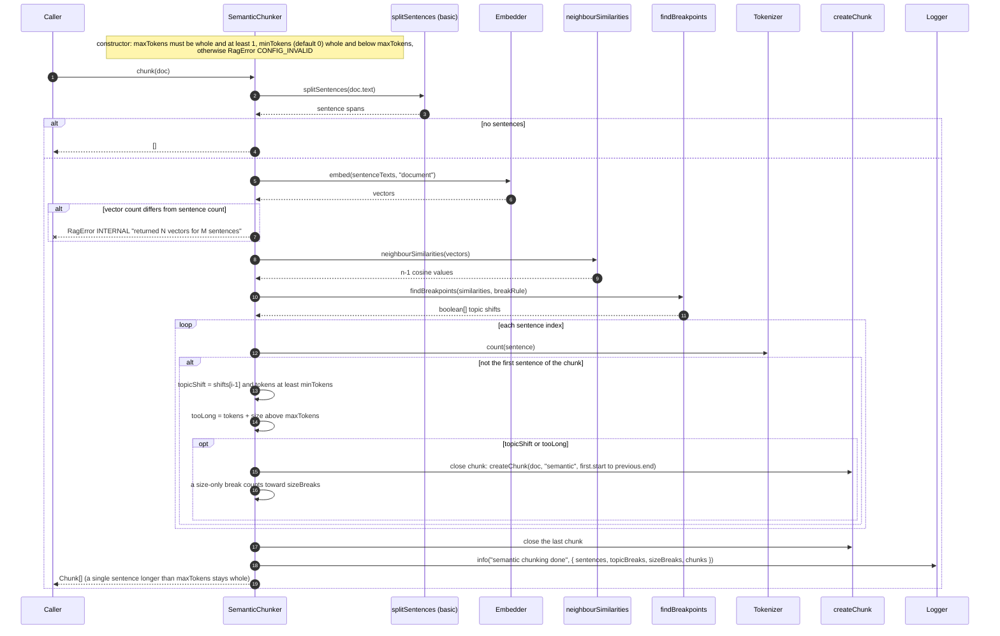
```mermaid
sequenceDiagram
  autonumber
  participant Caller
  participant SC as SemanticChunker
  participant SP as splitSentences (basic)
  participant EM as Embedder
  participant NS as neighbourSimilarities
  participant FB as findBreakpoints
  participant TK as Tokenizer
  participant CC as createChunk
  participant Log as Logger

  Note over SC: constructor: maxTokens must be whole and at least 1, minTokens (default 0) whole and below maxTokens,<br/>otherwise RagError CONFIG_INVALID
  Caller->>SC: chunk(doc)
  SC->>SP: splitSentences(doc.text)
  SP-->>SC: sentence spans
  alt no sentences
    SC-->>Caller: []
  else
    SC->>EM: embed(sentenceTexts, "document")
    EM-->>SC: vectors
    alt vector count differs from sentence count
      SC--xCaller: RagError INTERNAL "returned N vectors for M sentences"
    end
    SC->>NS: neighbourSimilarities(vectors)
    NS-->>SC: n-1 cosine values
    SC->>FB: findBreakpoints(similarities, breakRule)
    FB-->>SC: boolean[] topic shifts
    loop each sentence index
      SC->>TK: count(sentence)
      alt not the first sentence of the chunk
        SC->>SC: topicShift = shifts[i-1] and tokens at least minTokens
        SC->>SC: tooLong = tokens + size above maxTokens
        opt topicShift or tooLong
          SC->>CC: close chunk: createChunk(doc, "semantic", first.start to previous.end)
          SC->>SC: a size-only break counts toward sizeBreaks
        end
      end
    end
    SC->>CC: close the last chunk
    SC->>Log: info("semantic chunking done", { sentences, topicBreaks, sizeBreaks, chunks })
    SC-->>Caller: Chunk[] (a single sentence longer than maxTokens stays whole)
  end
```

## 15. Semantic breakpoints

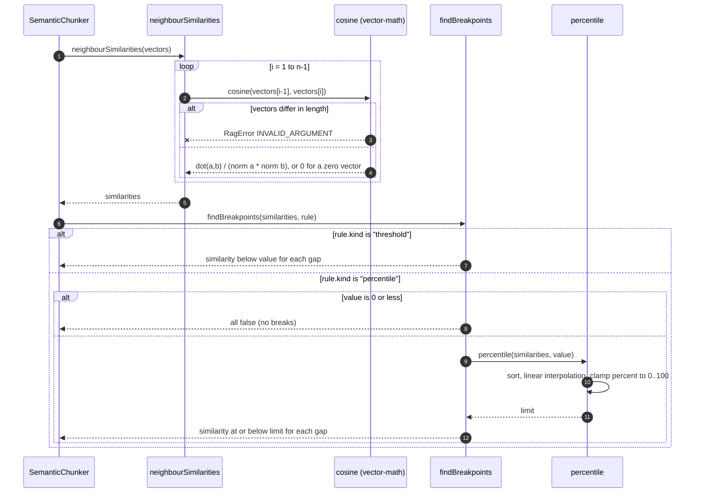
```mermaid
sequenceDiagram
  autonumber
  participant SC as SemanticChunker
  participant NS as neighbourSimilarities
  participant VM as cosine (vector-math)
  participant FB as findBreakpoints
  participant PE as percentile

  SC->>NS: neighbourSimilarities(vectors)
  loop i = 1 to n-1
    NS->>VM: cosine(vectors[i-1], vectors[i])
    alt vectors differ in length
      VM--xNS: RagError INVALID_ARGUMENT
    else
      VM-->>NS: dot(a,b) / (norm a * norm b), or 0 for a zero vector
    end
  end
  NS-->>SC: similarities
  SC->>FB: findBreakpoints(similarities, rule)
  alt rule.kind is "threshold"
    FB-->>SC: similarity below value for each gap
  else rule.kind is "percentile"
    alt value is 0 or less
      FB-->>SC: all false (no breaks)
    else
      FB->>PE: percentile(similarities, value)
      PE->>PE: sort, linear interpolation, clamp percent to 0..100
      PE-->>FB: limit
      FB-->>SC: similarity at or below limit for each gap
    end
  end
```

## 16. Chunk stats and report

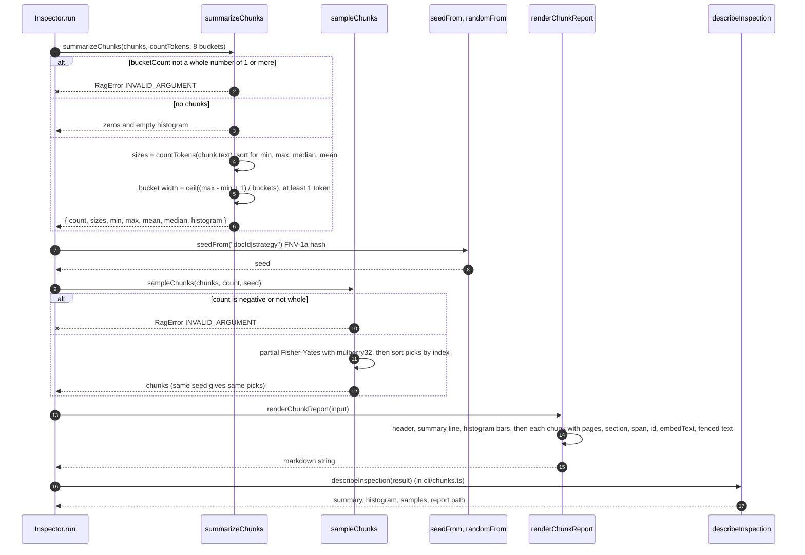
```mermaid
sequenceDiagram
  autonumber
  participant IN as Inspector.run
  participant SU as summarizeChunks
  participant SA as sampleChunks
  participant SF as seedFrom, randomFrom
  participant RR as renderChunkReport
  participant DI as describeInspection

  IN->>SU: summarizeChunks(chunks, countTokens, 8 buckets)
  alt bucketCount not a whole number of 1 or more
    SU--xIN: RagError INVALID_ARGUMENT
  else no chunks
    SU-->>IN: zeros and empty histogram
  else
    SU->>SU: sizes = countTokens(chunk.text), sort for min, max, median, mean
    SU->>SU: bucket width = ceil((max - min + 1) / buckets), at least 1 token
    SU-->>IN: { count, sizes, min, max, mean, median, histogram }
  end
  IN->>SF: seedFrom("docId|strategy") FNV-1a hash
  SF-->>IN: seed
  IN->>SA: sampleChunks(chunks, count, seed)
  alt count is negative or not whole
    SA--xIN: RagError INVALID_ARGUMENT
  else
    SA->>SA: partial Fisher-Yates with mulberry32, then sort picks by index
    SA-->>IN: chunks (same seed gives same picks)
  end
  IN->>RR: renderChunkReport(input)
  RR->>RR: header, summary line, histogram bars, then each chunk with pages, section, span, id, embedText, fenced text
  RR-->>IN: markdown string
  IN->>DI: describeInspection(result) (in cli/chunks.ts)
  DI-->>IN: summary, histogram, samples, report path
```

## 17. The shared contract test

Every chunker's test file calls `describeChunkerContract`, so a strategy is not done until it passes.

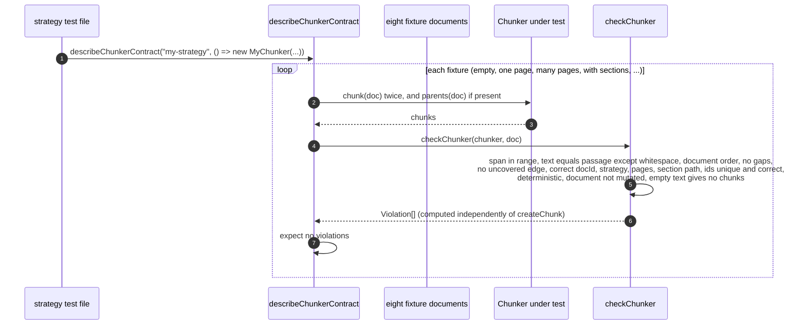
```mermaid
sequenceDiagram
  autonumber
  participant T as strategy test file
  participant D as describeChunkerContract
  participant FX as eight fixture documents
  participant CK as Chunker under test
  participant CH as checkChunker

  T->>D: describeChunkerContract("my-strategy", () => new MyChunker(...))
  loop each fixture (empty, one page, many pages, with sections, ...)
    D->>CK: chunk(doc) twice, and parents(doc) if present
    CK-->>D: chunks
    D->>CH: checkChunker(chunker, doc)
    CH->>CH: span in range, text equals passage except whitespace, document order, no gaps,<br/>no uncovered edge, correct docId, strategy, pages, section path, ids unique and correct,<br/>deterministic, document not mutated, empty text gives no chunks
    CH-->>D: Violation[] (computed independently of createChunk)
    D->>D: expect no violations
  end
```
